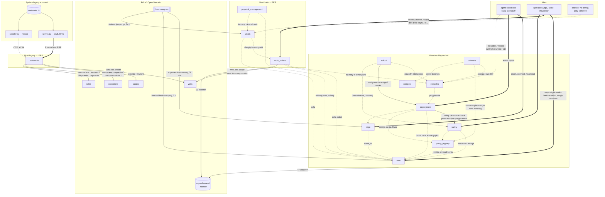
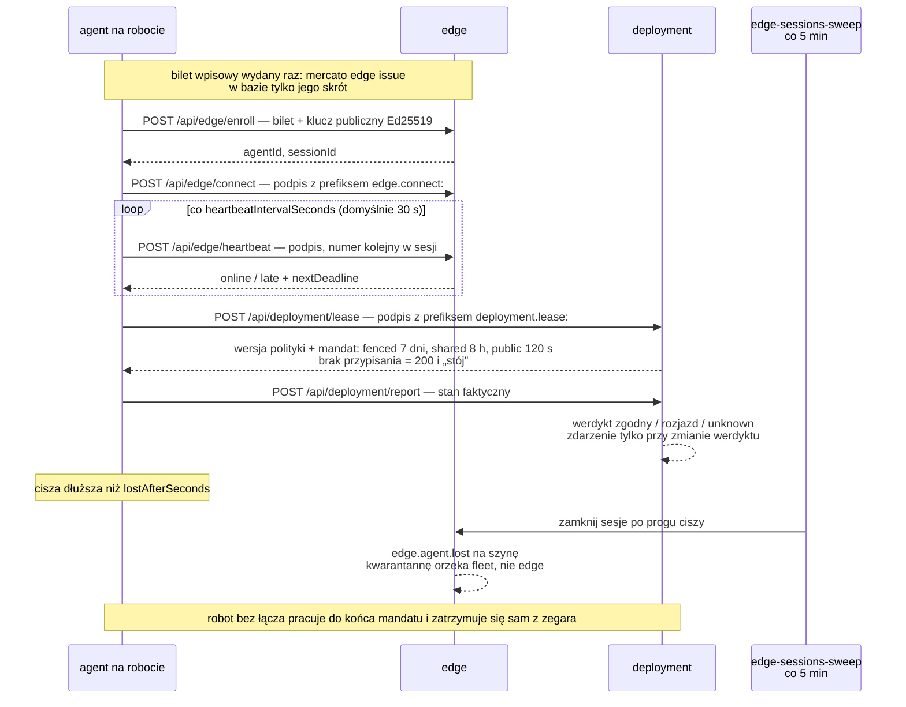
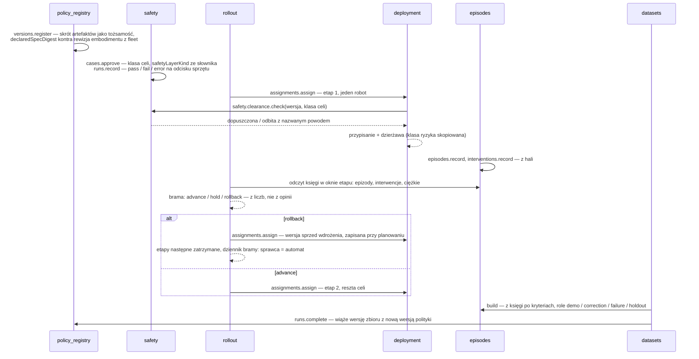
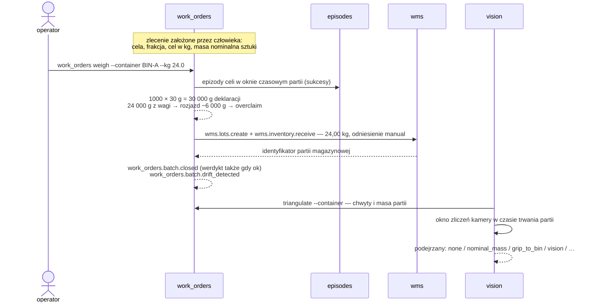

# Sortownia i Physical AI

Platforma operacyjna sortowni odpadów zbudowana na Open Mercato. Trzy warstwy,
które w zakładzie istnieją osobno i dotąd nie rozmawiały ze sobą: stary system
ewidencji z lat dziewięćdziesiątych, ewidencja magazynowo-sprzedażowa oraz hala
z robotami sortującymi, wagami i kamerami.

Repozytorium zawiera symulator systemu legacy (Python), czternaście modułów
Open Mercato (TypeScript) i dokumentację decyzji projektowych. Nie zawiera
samej platformy — moduły kopiuje się do klonu Open Mercato skryptem
`mercato/install.sh`.

## Po co to powstało

Sortownia pracuje na systemie, który wie tylko tyle, ile wiedział webERP:
kontrahent, frakcja, lokalizacja, ruch magazynowy w kilogramach. Nie wie,
ile boks może pomieścić, czyj odpad w nim leży, czy zamówienie ma pokrycie
w magazynie, ani czy faktura została zapłacona. Księga ruchów potrafi zejść
poniżej zera i nikt się o tym nie dowie przed załadunkiem.

Równolegle na halę wchodzą roboty sortujące, których sterowanie jest wyuczone,
a nie zaprogramowane. Od 20 stycznia 2027 obowiązuje rozporządzenie maszynowe
(UE) 2023/1230; AI Act od 2 lutego 2025 zakazuje pewnych klas detekcji
w miejscu pracy; Kodeks pracy nakazuje zniszczyć nagrania z hali po trzech
miesiącach. Regulator, odbiorca frakcji i ubezpieczyciel będą pytać: która
wersja sterownika pracowała na której maszynie, kto ją dopuścił, na jakiej
podstawie, ile razy człowiek musiał interweniować i co się stało z nagraniem.

Projekt odpowiada na obie potrzeby jedną platformą:

| Warstwa | Co daje zakładowi | Czego nie robi |
| --- | --- | --- |
| Most do systemu legacy | migrację bez zatrzymania produkcji: dane płyną dwoma kanałami tak, jak z prawdziwego webERP, import jest powtarzalny i nie dubluje | nie zastępuje starego systemu od razu; nie pisze do niego |
| Ewidencja w Open Mercato | pojemność boksów, partie z dostawcą, rezerwacje z odmową przy braku pokrycia, faktury i wpłaty powiązane z zamówieniem, karty przekazania odpadu dla wydań, które zaszły, bilans masy co do kilograma | nie łączy się z rządowym BDO; nie prowadzi księgi zakupów |
| Warstwa Physical AI | audytowalny zapis: która polityka, na której maszynie, pod jakim uzasadnieniem bezpieczeństwa, z jakim wynikiem; wdrożenia etapowe z automatycznym wycofaniem; dane korekcyjne do następnego treningu | nie steruje robotem, nie uczy polityki, nie zatrzymuje maszyny — to robi deterministyczna warstwa bezpieczeństwa poza platformą |
| Most hala ↔ ERP | praca robota staje się stanem magazynu, ale w masie z wagi; robot, który gubi materiał, dostaje flagę, a magazyn prawdę | nie zleca pracy z zamówień; nie rozdziela materiału między pojemniki |

## Kto z tego korzysta

| Rola | Co widzi i co może | Gdzie |
| --- | --- | --- |
| Dyrektor zakładu | bilans masy, sprawność sortowania, przychód per frakcja, rozrachunki z odbiorcami, zapełnienie boksów, najwięksi odbiorcy i dostawcy | `/backend/sortownia`, kafelki pulpitu głównego |
| Brygadzista, operator hali | rzut hali w skali, stan i łączność każdego robota, przejścia stanu z własnym podpisem (dopuszczenie, kwarantanna), ważenie partii, zgłoszenie incydentu bez pytania przełożonego | `/backend/plant`, `/backend/fleet/<id>`, `/backend/work_orders`, `/backend/safety` |
| Księgowość, handel | faktury wystawione z zamówień, wpłaty alokowane na faktury, wiek należności, karty przekazania, firmy i szanse sprzedaży spójne ze sobą | moduły `sales` i `customers` platformy |
| Inżynier robotyki | rejestr wersji polityk, dzierżawy, kadencja interwencji, wdrożenia etapowe z bramą, zbiory treningowe z pochodzeniem, plan obciążenia węzła obliczeniowego | `/backend/policies`, `/backend/deployment`, `/backend/episodes`, `/backend/rollout`, `/backend/datasets`, `mercato compute plan` |
| BHP, pełnomocnik ds. zgodności | uzasadnienia bezpieczeństwa per klasa celi, zestawy ewaluacyjne, incydenty z klasyfikacją, retencja nagrań, odmowy zakazanych klas detekcji | `/backend/safety`, `/backend/vision` |
| IT | instalacja modułów, migracje, harmonogramy, kafelki, 59 typowanych zdarzeń do automatyzacji workflow | `mercato/install.sh`, CLI, `GET /api/events` |

## Architektura

Trzy światy, cztery grupy modułów, jeden rdzeń. Trzy rodzaje strzałek, bo to
trzy różne mechanizmy:

| Strzałka | Znaczy | Przykład |
| --- | --- | --- |
| `==>` | HTTP z hali, bez sesji użytkownika, podpis Ed25519 | agent → `POST /api/edge/heartbeat` |
| `-->` | komenda przez szynę Open Mercato: dziennik audytu, zdarzenia, indeks wyszukiwania | `deployment` → `safety.clearance.check` |
| `-.->` | odczyt encji innego modułu, bez zapisu | `rollout` czyta księgę `episodes` |



Kierunek strzałek jest kierunkiem zależności. Moduły warstwy Physical AI nie
dotykają `wms`, `catalog` ani `sales`; do magazynu piszą wyłącznie dwa mosty:
`sortownia` (z księgi legacy) i `work_orders` (z wagi). Zdarzenia trafiają na
szynę i nie mają dziś subskrybenta — kanał jest gotowy na automatyzacje,
obieg „zdarzenie → reakcja" nie jest jeszcze obserwowalny.

### Mapa repozytorium

```
openmercato_garbagekind/
├── legacy/            schema.sql, generate.py, server.py, spooler.py, xlsx.py
├── client/            weberp_sync.py — XML-RPC + wsad/ → out/*.csv
├── tests/             test_end_to_end.py — 19 testów kanału legacy
├── webui/             simag.html — makieta ekranu starego systemu (SIMAG 3.11)
├── run_demo.sh        generator → serwer → spooler → klient pełny → przyrostowy
├── docs/              architektura_sortowni_open_mercato.pptx
├── mercato/
│   ├── install.sh     kopiuje moduły do klonu Open Mercato i włącza je w modules.ts
│   ├── embodiments/   so101_follower.json — opis sprzętu manipulatora SO-101
│   ├── README.md      moduł sortownia w szczegółach
│   └── modules/       14 modułów
└── physical-ai/       README (dowody faz 0–6), ROADMAP, EVENTS, ERP-BRIDGE, VISION,
                       HMI, COMPUTE, PLANT-VIEW, OPERATIONS, EMBODIMENTS, HANDOFF-PHYSICAL
```

Każdy moduł ma ten sam szkielet: `index.ts`, `acl.ts`, `setup.ts`,
`data/entities.ts`, `migrations/`, `commands/`, `events.ts`, `api/`,
`backend/<ekran>/page.tsx`, `widgets/`, `cli.ts`, `i18n/`, `__tests__/`,
`__integration__/`. Moduł bez własnego stanu nie ma pustych plików na pokaz:
`hmi` nie ma `events.ts`, `sortownia` nie ma `commands/`.

## Most do systemu legacy

### Co to znaczy dla zakładu

Stary system zostaje w ruchu. Platforma czyta go tak, jak czytałaby prawdziwy
webERP — sześć metod XML-RPC, które w webERP istnieją, i pliki, które
w rzeczywistym wdrożeniu przychodzą z księgowości. Po zmianie jednego URL-a
ten sam klient zadziała przeciw produkcyjnej instancji. Import da się
uruchamiać wielokrotnie: drugi przebieg raportuje same duplikaty i nie
dopisuje ani jednego ruchu.

### Jak to działa


Symulator (`legacy/`) generuje powtarzalny zbiór: 8 kontrahentów, 6 frakcji,
6 lokalizacji, kilkaset ruchów historycznych i pulę ruchów przyszłych, które
spooler ujawnia z czasem — stąd żywa synchronizacja przyrostowa. Nazwy tabel
i kolumn są przepisane z webERP razem z jego dziwactwami (kontrahent to
`debtor`, wydanie ma ujemną ilość).

### Co dochodzi po drodze

| Legacy (webERP) | Open Mercato | Czego stary system nie miał |
| --- | --- | --- |
| `locations` | wms: magazyn, strefy, lokalizacje | pojemność boksu w kg — pasek zapełnienia, ostrzeżenie od 70 %, alarm od 90 % |
| `stockmaster` | catalog: produkt i wariant | kod odpadu jako SKU, kod procesu odzysku R1–R5, próg wysyłki z powiadomieniem `low_stock` |
| `debtorsmaster` | customers: firma | etap cyklu życia z roli (dostawca / klient), NIP i BDO, klucz idempotencji w polu `source` |
| — | customers: szansa sprzedaży | każdy odbiorca ma szansę `win` o wartości równej sumie brutto jego zamówień; dostawca nie ma żadnej |
| `stockmoves` PZ / SORT / WZ | `wms.inventory.receive` / `transfer` / `issue` | partia z dostawcą przy przyjęciu, para SORT jako jeden transfer, rozkład na partie FIFO, `stkmoveno` jako `referenceId` |
| `salesorders` | sales: zamówienie, faktura, wysyłka | VAT 23 %, numer faktury z generatora platformy, karta przekazania odpadu wyłącznie dla wydań, które zaszły |
| `debtortrans` | sales: wpłata z alokacją | saldo należności, wiek najstarszego niezapłaconego dokumentu |
| — | wms: rezerwacja | zamówienie otwarte blokuje masę; brak pokrycia to odmowa, nie cicha zgoda |

Kolejność importu wynika z zależności: zamówienie potrzebuje kontrahenta
i frakcji, karta przekazania potrzebuje zamówienia, wpłata potrzebuje faktury,
rezerwacja potrzebuje stanu:

```
topologia → frakcje → kontrahenci → zamówienia (+faktury)
          → karty przekazania → wpłaty → partie → księga ruchów → rezerwacje → CRM
```

Krok CRM (`lib/crm.ts`, także osobno `yarn mercato sortownia sync-crm`)
pilnuje, żeby zakładki „Firmy" i „Szanse sprzedaży" mówiły to samo: klient ma
szansę wygraną, potencjalny — otwartą, dostawca nie ma żadnej; w drugą stronę
wygrana szansa awansuje potencjalnego klienta na klienta.

### Pulpit dyrektora

`/backend/sortownia` liczy z encji WMS i sprzedaży, więc ekran nie może
rozjechać się z magazynem: masa na placu i w boksach, wysortowane i wydane
w 30 dni, przychód netto i brutto, faktury, saldo do zapłaty z wiekiem
należności, przychód i średnia cena per frakcja, bilans masy (przyjęte minus
wydane równa się temu, co leży — na żywych danych domyka się co do kilograma),
sprawność sortowania, karty przekazania, pochodzenie odpadu per dostawca,
zapełnienie lokalizacji, księga ruchów z numerem kwitu legacy. Magazyn liczy
w kilogramach, ekran pokazuje tony.

Szczegóły, w tym dwa błędy, które wyszły dopiero na żywych danych:
[`mercato/README.md`](mercato/README.md).

## Warstwa Physical AI

### Co to znaczy dla zakładu

Robot z wyuczonym sterowaniem to maszyna, której zachowanie zmienia się
z każdą wersją wag. Platforma nie próbuje tego zachowania kontrolować —
kontroluje, **co wolno uruchomić, gdzie i pod czyim podpisem**, i zapisuje,
co z tego wyszło. Cztery skutki praktyczne:

- Wersja polityki bez zatwierdzonego uzasadnienia bezpieczeństwa dla danej
  klasy celi nie da się przypisać do robota. Odmowa przychodzi z komendy
  przypisania, z nazwanym powodem.
- Wdrożenie nowej wersji idzie etapami; brama między etapami liczy z księgi
  epizodów, a przekroczenie progu wycofuje etap bez udziału człowieka. Nie ma
  uprawnienia „pomiń bramę".
- Robot w celi ogrodzonej pracuje dalej, gdy padnie łącze z centralą; robot
  w przestrzeni publicznej zatrzymuje się sam po 120 sekundach. Decyzja zapada
  lokalnie, z zegara.
- Każda interwencja człowieka jest rekordem: kto, kiedy, na jakim etapie,
  dlaczego. To jedyna liczba, która mówi, czy wdrożenie idzie do przodu, i
  jednocześnie najcenniejsze dane do następnego treningu.

### Łańcuch modułów

Osiem modułów w kolejności zależności; każde ogniwo działa bez tych poniżej:

```
fleet            co istnieje, gdzie stoi i czy wolno mu pracować
edge             kto się odzywa, czym to udowadnia, kiedy odezwał się ostatnio
policy_registry  co to za polityka i na jakim sprzęcie wolno ją uruchomić
safety           czy wolno ją uruchomić w tej KLASIE celi
deployment       ten robot ma uruchomić tę wersję, na tak długo
episodes         co zrobił i kto przerwał
rollout          iść dalej czy wycofać — z liczb księgi, nie z opinii
datasets         z jakich epizodów powstał zbiór i która polityka się na nim uczyła
```

Jeden wyjątek od jednokierunkowości: `deployment` woła
`safety.clearance.check` przed zapisem przypisania. Dopuszczenie jest warunkiem
wstępnym, nie skutkiem ubocznym.

| Moduł | Za co odpowiada | Tabele | Komendy | Zdarzenia | Testy | Ekran |
| --- | --- | ---: | ---: | ---: | ---: | --- |
| `fleet` | roboty, klasy sprzętowe, obiekty, cele, kalibracje z terminem ważności; właściciel osobno od operatora; geometria hali; akcje operatora z podpisem człowieka | 6 | 5 | 8 | 88 | `/backend/fleet`, `/backend/fleet/<id>`, `/backend/plant` |
| `edge` | tożsamość Ed25519 agenta, bilet wpisowy, sesje, uderzenia serca; żywotność liczona przy odczycie z `last_seen_at` | 4 | 7 | 7 | 55 | `/backend/edge` |
| `policy_registry` | wersje polityk identyfikowane skrótem artefaktów, wiązane z rewizją embodimentu, nie z robotem; `release` osobno od `manage` | 4 | 3 | 5 | 45 | `/backend/policies` |
| `safety` | uzasadnienie bezpieczeństwa per klasa celi z rodzajem warstwy ze słownika, zestawy ewaluacyjne, incydenty klasyfikowane z faktów; odmowa dla polityki zadeklarowanej jako funkcja bezpieczeństwa | 4 | 7 | 8 | 50 | `/backend/safety` |
| `deployment` | przypisanie wersji do robota i dzierżawa: `fenced` 7 dni, `shared` 8 h, `public` 120 s; uzgodnienie stanu z trzecim werdyktem `unknown` | 3 | 4 | 4 | 45 | `/backend/deployment` |
| `episodes` | epizod jako atom pracy, interwencja jako własna tabela; raport epizodów między interwencjami sprawdzany krzyżowo z księgą | 2 | 3 | 4 | 40 | `/backend/episodes` |
| `rollout` | wdrożenia etapowe z bramą na liczbach; wycofanie domyślne; dziennik bramy ze sprawcą (automat albo człowiek) | 4 | 3 | 5 | 37 | `/backend/rollout` |
| `datasets` | wersje zbiorów budowane z księgi po kryteriach, role `demo`/`correction`/`failure`/`holdout`, przebiegi treningowe zamykające pętlę w obie strony | 4 | 4 | 4 | 44 | `/backend/datasets` |

Faza jest zamknięta, gdy zdanie o zachowaniu systemu zachodzi na żywej
instancji, nie gdy suita jest zielona. Każdy moduł ma komendę `prove`;
przebiegi i tabele odrzuconych alternatyw są w `physical-ai/README.md`.

### Agent na robocie: od biletu do ciszy



Powtórka numeru kolejnego, obcy klucz i bilet użyty drugi raz odbijają się
jako 401. Heartbeat nie generuje zdarzenia; faktem jest dopiero jego brak.

### Od wgrania wag do nowej wersji



Wiązanie zbiór ↔ polityka powstaje wyłącznie przy domknięciu przebiegu
treningowego; przebieg udany bez wskazanej polityki jest odrzucany. Dzięki
temu regres jakości po treningu da się przypisać albo danym, albo treningowi.

## Most hala ↔ ERP

### Co to znaczy dla zakładu

Robot mówi: 1000 udanych chwytów. Przy masie nominalnej 30 g to 30,00 kg.
Waga pod pojemnikiem mówi: 24,00 kg. Sześciu kilogramów nie ma, a w telemetrii
robota nie widać po nich śladu. To jedyne miejsce w projekcie, w którym zdanie
maszyny o własnej pracy jest konfrontowane z czymś spoza maszyny.

- Do magazynu idzie masa z wagi, nigdy deklaracja robota. Robot gubiący co
  dziesiątą sztukę nie zamieni swojego błędu w stan magazynowy.
- Rozjazd nie wstrzymuje przyjęcia — materiał fizycznie istnieje. Werdykt
  `overclaim` podnosi flagę na maszynę i kieruje do niej człowieka.
- Most jest jednokierunkowy: epizody → masa. Zamówienie sprzedaży nie zleca
  pracy robotowi, bo ERP ma opóźnienia i tryby awarii systemu ewidencyjnego,
  nie sterowania ruchem.

| Moduł | Za co odpowiada | Tabele | Komendy | Zdarzenia | Testy | Ekran |
| --- | --- | ---: | ---: | ---: | ---: | --- |
| `sortownia` | most legacy → WMS, katalog, CRM, sprzedaż, KPO; pulpit; konektor Data Sync; bez własnych komend | 0 | 0 | 0 | 245 | `/backend/sortownia` |
| `work_orders` | zlecenie, partia, masa z wagi kontra deklaracja robota; rachunek w gramach całkowitych | 3 | 4 | 5 | 28 | `/backend/work_orders` |
| `vision` | kamery z celem ustawowym, detektory z progiem ufności, okna zliczeń, retencja 90 dni, triangulacja trzech świadków | 4 | 6 | 7 | 57 | `/backend/vision` |
| `physical_management` | digital twin hali: warstwa wyłącznie odczytowa nad `fleet` i `vision` | 0 | 0 | 0 | 0 | `/backend/physical-management` |
| `hmi` | żetony, słownik stanów i elementy SVG ekranów operatorskich; norma szara, kolor tylko dla odstępstwa | 0 | 0 | 0 | 26 | biblioteka |
| `compute` | rejestr węzłów obliczeniowych i przypisań; przepustowość pamięci obowiązkowa; rola `safety_function` nie istnieje w słowniku | 2 | 2 | 2 | 20 | CLI |

### Partia na wadze



### Trzeci świadek

Dwóch świadków — deklaracja robota i waga — wystarcza, żeby stwierdzić, że
coś się nie zgadza. Trzech, żeby powiedzieć co. Kamera nad pojemnikiem jest
trzecim, niezależnym pomiarem:

| wizja | robot | masa | podejrzany |
| ---: | ---: | ---: | --- |
| 1000 | 1000 | 1000 | `none` |
| 1000 | 1000 | 800 | `nominal_mass` — sztuki lżejsze niż nominał, nie wina robota |
| 800 | 1000 | 800 | `grip_to_bin` — materiał ginie między chwytem a pojemnikiem |
| 800 | 1000 | 1000 | `vision` — kamera nie widzi, materiał jest |
| 1300 | 1000 | 1000 | `foreign_material` |
| 1000 | 700 | 1000 | `under_reporting` |
| 600 | 1000 | 1500 | `inconclusive` |

Prawdziwy powód, dla którego w sortowni stawia się kamerę nad pojemnikiem,
to zdanie „ta frakcja PET ma 4 % PCW". Odbiorca z takim wynikiem odeśle
transport, a spór będzie o to, czy zanieczyszczenie powstało u nas.
`contamination()` liczy udział obcych klas; pusty pojemnik daje `null`,
nie zero procent.

Platforma nie widzi ani jednej klatki. Wnioskowanie dzieje się na brzegu, do
ERP trafiają okna zliczeń i materiał dowodowy przez odniesienie, z terminem
usunięcia liczonym z kamery. Odmowy są odrzuceniem zapisu, nie ostrzeżeniem:
detektor ze słownikiem emocji lub biometrii (AI Act art. 5), kamera z celem
spoza katalogu art. 22² Kodeksu pracy, retencja ponad 90 dni, próg ufności
równy zeru. Klasa `person` przechodzi wyłącznie jako obecność.

### Digital twin hali

Dwa ekrany, zero własnych tabel, żadnego zmyślania.

`/backend/physical-management` to jeden endpoint odczytowy nad `fleet` i
`vision`: obiekt, cele z geometrią i klasą ryzyka, źródła wideo, anonimowe
zliczenia osób. Odpowiedź niesie deklarację `rawVideoStoredInErp: false`,
`biometricIdentityStored: false`. Stan kamery wynika z wieku ostatniego okna,
nie z flagi.

`/backend/plant` to rzut hali w skali. Cela bez kompletu współrzędnych nie
jest rysowana, tylko wypisana obok — zmyślona pozycja jest gorsza niż jej
brak, bo brak widać. Robot „w ruchu", o którym centrala nic nie wie od pół
godziny, wygląda inaczej niż robot w ruchu, który się odzywa: wypełnienie
mówi o stanie, pierścień o łączności, wykrzyknik o kalibracji. Stan normalny
jest szary; kolor jest zarezerwowany dla odstępstwa (ISA-101).


Trzy warstwy są opcjonalne: brak modułu albo uprawnienia odejmuje warstwę
informacji i jest wypisany w nagłówku, zamiast wywracać rysunek. Łączenie idzie
po identyfikatorze celi, nie po nazwie.

## Zgodność i bezpieczeństwo

| Wymóg | Podstawa | Jak platforma to wymusza |
| --- | --- | --- |
| Wyuczona polityka nie jest funkcją bezpieczeństwa | rozporządzenie (UE) 2023/1230, Annex I część A; AI Act art. 6 ust. 1 | uzasadnienie z `declaredAsSafetyFunction: true` nie daje się zatwierdzić; rola `safety_function` nie istnieje w słowniku `compute`; `safetyLayerKind` ze słownika zamkniętego (`hardware_estop`, `safety_plc`, `light_curtain`, …) |
| Dopuszczenie do ruchu ma podstawę i termin | ISO 10218-1/-2:2025, ISO/TS 15066:2016 | uzasadnienie per klasa celi z `valid_until`, zestawy ewaluacyjne wymagane per klasa ryzyka, liczy się najnowszy przebieg na tym samym odcisku sprzętu |
| Zakaz wnioskowania emocji i kategoryzacji biometrycznej w pracy | AI Act art. 5 ust. 1 lit. f i g (od 2 lutego 2025) | rejestracja detektora ze słownikiem zawierającym `emotion`, `face_id`, `gender`, … jest odrzucana; dopasowanie po rdzeniu słowa |
| Monitoring tylko w zamkniętym katalogu celów, nagrania niszczone po 3 miesiącach | art. 22² § 1 i § 3 Kodeksu pracy | kamera z celem spoza katalogu lub retencją > 90 dni jest odrzucana; worker oznacza materiał po terminie i ogłasza zaległość codziennie, dopóki bajty nie zostaną potwierdzone jako usunięte |
| Odpowiedzialność człowieka za dopuszczenie | — | przejście robota do ruchu wymaga `approvedBy` podanego z przeglądarki po świadomym potwierdzeniu; serwer nie podpisuje za nikogo |
| Incydent zgłaszany bez progu | — | `safety.incidents.report` ma każdy, kto stoi przy maszynie; ciężar klasyfikuje system z faktów, nie zgłaszający; incydent wstrzymujący wycofuje dopuszczenie dla całej klasy celi |

## Operacje

### Zadania cykliczne

| Moduł | Kolejka | Co ile | Co robi |
| --- | --- | --- | --- |
| `vision` | `vision-clips-purge` | 24 h | oznacza materiał po terminie ustawowym; bajtów nie kasuje, czeka na `vision.clips.confirm_deletion` od tego, kto je trzyma |
| `edge` | `edge-sessions-sweep` | 5 min | zamyka sesje agentów po progu ciszy i ogłasza `agent.lost`; nie kwarantannuje |
| `fleet` | `fleet-calibration-expiry` | 1 h | ogłasza wygaśnięcie kalibracji raz na kalibrację; nie zatrzymuje maszyn |

Wszystko, co platforma zasiewa przy inicjalizacji tenanta — uprawnienia ról,
harmonogramy, listy kafelków — jest dla modułu doinstalowanego później
niedostępne, a brak nie objawia się błędem, tylko ciszą. Stąd idempotentne
komendy `install-schedules` i `install-widgets`.

### Kafelki pulpitu głównego

`fleet.dashboard.readiness` (ile maszyn wolno uruchomić, ile w kwarantannie,
co blokuje resztę), `edge.dashboard.liveness` (kto się odzywa, kto milczy,
od kiedy), `safety.dashboard.clearance` (ile par polityka × klasa celi jest
dopuszczonych, ile zablokowanych).

### Zdarzenia

59 zdarzeń w 11 modułach, żadnego zadeklarowanego bez `emit` w kodzie, każde
z typowanym ładunkiem dla edytora workflow. Trzy reguły częstotliwości: ruch
nie jest faktem (heartbeat nie emituje, jego brak tak), wyzwalanie zboczem
(rozjazd trwający pół godziny to jedno zdarzenie), odhaczanie w danych
(wygaśnięcie kalibracji ogłaszane raz). Katalog:
`GET /api/events?module=<nazwa>` i [`physical-ai/EVENTS.md`](physical-ai/EVENTS.md).

### Wejścia agenta brzegowego

Jedyne endpointy bez sesji użytkownika — uwierzytelnienie podpisem Ed25519
kluczem, którego centrala nie ma:

```
POST /api/edge/enroll
POST /api/edge/connect
POST /api/edge/heartbeat
POST /api/deployment/lease
POST /api/deployment/report
```

Człowiek wchodzi inną trasą (`fleet/lib/commandRoute.ts`): sesją, ze
strażnikiem mutacji, przez szynę komend — a więc z wpisem do dziennika audytu.

## Zasady inżynierskie

1. Zapis wyłącznie szyną komend; uprawnienia przez `acl.ts` i `setup.ts`;
   encje przez MikroORM z jawną migracją; ekran przez `backend/<nazwa>/page.tsx`.
2. Każda faza wypisuje, czego w module nie ma i dlaczego.
3. Dowód zaliczenia to zdanie o zachowaniu systemu na żywej instancji.
4. Każda decyzja z kuszącą alternatywą trafia do tabeli z powodem odrzucenia.
5. Nie wolno rozluźniać asercji, żeby test przeszedł.

Trzy warunki, pod którymi Open Mercato jest właściwym fundamentem:
`catalog`, `sales`, `wms` nie stają się zależnością modułu robotycznego;
żadna telemetria, artefakt binarny ani strumień teleoperacji nie idzie przez
szynę komend ani MikroORM (w tabelach są adresy i skróty); wyuczona polityka
nigdy nie jest funkcją bezpieczeństwa.

Trzy reguły, które projekt zapisał, bo powtórzył błąd: okno czasowe
wyprowadzać z danych, nigdy z zegara ani ze stałej; stan wyliczać przy
odczycie, nie gasić flagą zadaniem cyklicznym; niewiedza ma być widoczna
w danych (`unknown` w opisie sprzętu, cela nierozmieszczona na liście obok
rzutu, `null` zamiast zera przy pustym pojemniku).

## Uruchomienie

Wymagania: Python 3.11+ (sama biblioteka standardowa), klon Open Mercato
(Node.js, Yarn, PostgreSQL; Redis i Meilisearch opcjonalne).

Kanał legacy, sam w sobie, bez Open Mercato:

```bash
./run_demo.sh                              # generator → serwer → spooler → klient pełny → przyrostowy
python3 -m unittest discover -s tests -t . -v
```

Krok po kroku:

```bash
python3 legacy/generate.py --db legacy/sortownia.db --wsad legacy/wsad
python3 legacy/server.py  --db legacy/sortownia.db --port 8088 &
python3 legacy/spooler.py --db legacy/sortownia.db --wsad legacy/wsad --interval 5 &
python3 client/weberp_sync.py --wsad legacy/wsad --out out --full
python3 client/weberp_sync.py --out out    # kolejne uruchomienia: tryb przyrostowy
```

Konto testowe legacy: `demo` / `demo`, firma `weberpdemo`.

Moduły w klonie Open Mercato:

```bash
MERCATO_ROOT=/sciezka/do/open-mercato ./mercato/install.sh    # albo: install.sh fleet edge
cd /sciezka/do/open-mercato/apps/mercato
yarn generate && yarn mercato db migrate
yarn mercato auth sync-role-acls
yarn mercato sortownia import              # wymaga działającego legacy/server.py
yarn mercato fleet seed
yarn mercato <moduł> prove                 # dowód fazy: fleet, edge, policy_registry, deployment,
                                           # episodes, rollout, safety, datasets, work_orders, vision
yarn mercato vision install-schedules && yarn mercato edge install-schedules && yarn mercato fleet install-schedules
yarn mercato fleet install-widgets && yarn mercato edge install-widgets && yarn mercato safety install-widgets
```

Testy modułów:

```bash
cd apps/mercato
yarn jest src/modules/sortownia            # 245
yarn jest src/modules/fleet                # i tak dalej: 14 modułów, razem 780 testów
```

## Granice i dług

- Karty przekazania odpadu są wewnętrznym odzwierciedleniem KPO powiązanym
  z wysyłką; nie ma połączenia z rządowym API rejestru BDO.
- Przyjęcie odpadu na plac jest operacją magazynową. Nie ma księgi zakupowej
  ani fakturowania opłat bramowych od dostawców.
- Sprzedaż frakcji nalicza 23 % VAT bez podzielonej płatności i odwrotnego
  obciążenia.
- Uruchamianie importu z panelu Data Sync nie było jeszcze przechodzone
  end-to-end; przebiegi szły komendą CLI.
- Platforma nie wysyła poleceń trajektorii do sterowników robotów.
  Zatrzymanie natychmiastowe należy do deterministycznej warstwy
  bezpieczeństwa, która nie przechodzi przez tę platformę.
- Żaden moduł nie widział prawdziwej wagi, prawdziwego robota ani prawdziwej
  kamery. Epizody, masy i zliczenia w dowodach pochodzą z komend `prove`.
- Epizody, interwencje i okna detekcji wchodzą wyłącznie szyną komend i CLI.
  Warstwa HTTP dla telemetrii agenta nie istnieje.
- Kolejność, jednostki i układy odniesienia wektora obserwacji i akcji są
  kontraktem słownym. System sprawdza liczbę wymiarów, nie ich znaczenie —
  polityka licząca w złych jednostkach przejdzie każdą bramkę.
- Kategoria przyczyny interwencji jest wolnym tekstem do czasu, aż zespół
  robotyczny dostarczy zamkniętą listę.

Pełna lista tego, co zespół uczący roboty musi dostarczyć, z podziałem na
bramki twarde, ostrzeżenia i jakość:
[`physical-ai/HANDOFF-PHYSICAL.md`](physical-ai/HANDOFF-PHYSICAL.md).

## Liczby

| | |
| --- | --- |
| Moduły Open Mercato | 14 |
| Tabele w migracjach | 40 |
| Własne komendy | 48 |
| Zdarzenia z typowanym ładunkiem | 59 |
| Testy TypeScript | 780 |
| Testy Python | 19 |
| Zweryfikowane na żywej instancji | 8 kontrahentów, 46 zamówień, 46 faktur, 29 kart przekazania, 11 wpłat, 80 partii, 239 ruchów legacy → 174 operacje WMS bez błędów; bilans masy domknięty co do kilograma |

Liczby policzone z `migrations/`, `commands/`, `events.ts` i `__tests__/`
każdego modułu na gałęzi `main`.

## Dokumentacja

- [`mercato/README.md`](mercato/README.md) — moduł `sortownia`
- [`physical-ai/README.md`](physical-ai/README.md) — decyzje i dowody faz 0–6
- [`physical-ai/ROADMAP.md`](physical-ai/ROADMAP.md) — mapa faz
- [`physical-ai/ERP-BRIDGE.md`](physical-ai/ERP-BRIDGE.md) — `work_orders`
- [`physical-ai/VISION.md`](physical-ai/VISION.md) — `vision`
- [`physical-ai/PLANT-VIEW.md`](physical-ai/PLANT-VIEW.md), [`physical-ai/HMI.md`](physical-ai/HMI.md) — rzut hali i system wizualny
- [`physical-ai/EVENTS.md`](physical-ai/EVENTS.md) — zdarzenia modułowe
- [`physical-ai/OPERATIONS.md`](physical-ai/OPERATIONS.md) — zadania cykliczne, kafelki, komendy instalacyjne
- [`physical-ai/COMPUTE.md`](physical-ai/COMPUTE.md) — `compute` i DGX Spark
- [`physical-ai/EMBODIMENTS.md`](physical-ai/EMBODIMENTS.md) — format opisu sprzętu
- [`physical-ai/HANDOFF-PHYSICAL.md`](physical-ai/HANDOFF-PHYSICAL.md) — zadania dla zespołu uczącego roboty
- [`GREG_HANDOFF.md`](GREG_HANDOFF.md) — warunki uznania SO-101 za zwalidowany fizycznie: procedura odbioru, kontrakty danych i 22 testy
- [`physical-ai/MATERIAL-MERCATOXD.md`](physical-ai/MATERIAL-MERCATOXD.md) — inwentaryzacja materiału z hackathonu względem naszych bram
- [`docs/architektura_sortowni_open_mercato.pptx`](docs/architektura_sortowni_open_mercato.pptx) — prezentacja architektury
