# Sortownia i Physical AI

> **Zbudowane podczas hackathonu 18-19 września 2026.** Wszystko poniżej
> powstało w tym oknie czasowym i działa na żywej instancji Open Mercato -
> zrzuty ekranu w tym dokumencie są z uruchomionego systemu, nie z makiet.
> Co jest zwalidowane, a co nie - rozstrzyga sekcja
> [Stan walidacji](#stan-walidacji), aktualizowana przy każdym przebiegu.

## W skrócie, prostymi słowami

Sortownia odpadów ma trzy systemy, które ze sobą nie rozmawiają:

1. **stary program ewidencyjny** z lat dziewięćdziesiątych - wie, ile kilogramów
   przyjechało i wyjechało, i nic poza tym;
2. **zeszyt i Excel brygadzisty** - pojemność boksów, czyj odpad gdzie leży,
   kto zapłacił;
3. **hala z robotami**, które od niedawna sortują same, bo ich sterowanie jest
   **wyuczone**, a nie zaprogramowane.

Zrobiliśmy jedną platformę, która spina wszystkie trzy. Konkretnie:

- **czyta stary system** dwoma kanałami (XML-RPC i pliki) i przepisuje jego
  ewidencję do Open Mercato - powtarzalnie, bez duplikatów, bez zatrzymywania
  produkcji;
- **domyka to, czego stary system nie wiedział**: ile boks pomieści, z której
  dostawy pochodzi masa w boksie, czy zamówienie odbiorcy ma pokrycie
  w magazynie, czy faktura została zapłacona, czy bilans masy się zgadza;
- **prowadzi rejestr robotów uczonych**: która wersja sterownika pracuje na
  której maszynie, kto ją dopuścił, na jakiej podstawie, ile razy człowiek
  musiał interweniować - i odmawia dopuszczenia, gdy czegoś brakuje;
- **uzgadnia pracę robota z wagą**: robot mówi, ile przesortował, waga mówi,
  ile naprawdę. Do magazynu wchodzi liczba z wagi, a rozbieżność jest oceną
  robota, nie magazynu.

Jednym zdaniem: **odpad ma od teraz tożsamość i ślad - od bramy wjazdowej,
przez boks i robota, po fakturę i kartę przekazania.**

---

## Jak to spełnia kryteria hackathonu

| Kryterium | Jak jest spełnione |
| --- | --- |
| **Kompletny proces end-to-end** | Jeden przebieg łączy: przyjęcie odpadu na bramie → partia z dostawcą i datą → sortowanie na hali (robot lub ręcznie) → boks z pojemnością → rezerwacja pod zamówienie → wydanie do odbiorcy → karta przekazania odpadu → faktura → wpłata → bilans masy. Żaden krok nie jest zaślepką: każdy ma własną komendę, migrację, testy i ekran. Dowód: przebieg importu opisany w [`mercato/README.md`](mercato/README.md) i zrzuty niżej. |
| **Możliwy do oszacowania efekt finansowy** | Model liczbowy z jawnymi wejściami jest w sekcji [Efekt finansowy](#efekt-finansowy). Opiera się na wielkościach, które system **już mierzy** na żywej instancji: 152 624 zł zaległych należności (najstarszy dokument 28 dni), 0,61 zł/kg średniej ceny sprzedaży, 27,555 t masy zarezerwowanej pod 5 zamówień, jedno zamówienie odrzucone przez WMS z braku pokrycia. |
| **Konkretny właściciel biznesowy** | **Dyrektor zakładu** - właściciel wyniku (bilans masy, sprawność sortowania, przychód per frakcja, rozrachunki). Współwłaściciele operacyjni: **brygadzista hali** (dopuszczenia maszyn, ważenie partii, incydenty) i **pełnomocnik ds. zgodności/BHP** (uzasadnienia bezpieczeństwa, retencja nagrań). Każdy z nich ma w systemie własny ekran i własne uprawnienia - patrz [Kto z tego korzysta](#kto-z-tego-korzysta). |
| **Rzeczywiste lub realistyczne dane** | Dwa źródła, oba opisane wprost: (1) **realistyczne dane ewidencyjne** - generator odtwarzający schemat i dialekt prawdziwego systemu webERP, 299 wierszy księgi ruchów, 8 kontrahentów, 46 zamówień, 46 faktur, 109 partii; (2) **rzeczywiste pomiary sprzętowe** - telemetria CAN-FD ramienia Galaxea A1X z realnego stanowiska, w tym udokumentowany incydent ruchu 76,36° przy załączeniu bez utrzymania pozycji zadanej. Materiał źródłowy i jego pochodzenie: [`physical-ai/MATERIAL-MERCATOXD.md`](physical-ai/MATERIAL-MERCATOXD.md). |

---

## Stan walidacji

Ta sekcja istnieje po to, żeby nikt nie musiał zgadywać, co jest sprawdzone,
a co tylko napisane. Aktualizujemy ją przy każdym przebiegu.

### Zwalidowane na sprzęcie i na żywej instancji

| Co | Jak sprawdzone | Dowód |
| --- | --- | --- |
| **Magistrala SO-101** | podłączone ramię, `/dev/ttyACM0`, przejściówka S/N `5AAF220303` | sześć serw STS3215, ID 1-6, firmware 3.10 |
| **Zwolnienie momentu** | polecenie `torque-off` na podłączonym ramieniu | `Torque_Enable` = 0 na sześciu serwach |
| **Bezpieczne załączenie** | reguła z incydentu 76,36°: pozycja zadana równa bieżącej trzymana 500 ms | odchyłka **0 ticków** przez cały czas trzymania |
| **Ruch pod bramami** | przejazd dwóch stawów o 10° z limitem przyrostu i bramą obciążenia | maks. błąd **2,2°**, czas 0,32 s, zero zatrzymań na obciążeniu |
| **Kanał brzegowy** | niezależny agent (Python, inny autor, na podstawie samej specyfikacji) przeciwko uruchomionej instancji | **100 podpisanych uderzeń serca, sekwencja 1→100 bez luki** |
| **Dzierżawa i uzgodnienie stanu** | ten sam agent: pobranie stanu pożądanego, podpisane zgłoszenie stanu | werdykt `converged` w `deployment_state_reports` |
| **Zgodność kontraktu** | podpisy agenta weryfikowane **modułami, których używa serwer** | siedem komunikatów, odcisk klucza, odrzucenie podpisu z obcego kontekstu |
| **Zamiatanie sesji** | pięć minut ciszy podczas przebiegu | centrala zamknęła sesję i wymusiła ponowne połączenie |
| **Epizod z prawdziwej maszyny w księdze** | dziennik ruchu SO-101 wypchnięty podpisanym kanałem `/api/edge/telemetry` | `so101-random-pose`, wynik `success`, przypisany do `SO101-5AAF220303` |
| **Idempotencja telemetrii** | ten sam dziennik wypchnięty dwa razy | jeden rekord w księdze, nie dwa |

Przebieg sprzętowy: [`docs/handoff/so101-run-2026-09-20/`](docs/handoff/so101-run-2026-09-20/README.md)
z surowym `evidence.json` i dziennikiem ruchu.

Warstwa ewidencyjna jest zwalidowana osobno i wcześniej: 299 wierszy księgi
legacy → 217 kwitów → 309 ruchów WMS bez błędów, powtórny import daje 217
duplikatów i zero zapisów, bilans masy domyka się co do kilograma.

### Czego walidacja **nie** obejmuje

Cztery rzeczy, bez których nie wolno mówić o odbiorze fizycznym:

1. **Kalibracja** nie została przeprowadzona. Procedura LeRobot jest
   interaktywna i wymaga ręcznego przeprowadzenia każdego stawu przez pełny
   zakres. Odczyt rejestrów ma status `observed`, nie `passed`.
2. **Zasięg, udźwig i zasilanie** nie zostały zmierzone. W raporcie stoją jako
   `placeholder` z `provenance: synthetic` - to jawnie nie jest pomiar.
3. **Nie ma sprzętowego wyłącznika awaryjnego.** Zestaw nie ma przerywacza
   dwukanałowego, więc nie ma czego zmierzyć. Zwolnienie momentu idzie tą samą
   magistralą i tym samym procesem, który może zawisnąć - **nie jest E-stopem**.
4. **Nie ma zaliczonego autonomicznego chwytu.** Model nie wyemitował akcji
   chwytaka w żadnej obserwowanej próbie.

Do tego jedna rzecz, o której łatwo zapomnieć przy patrzeniu na pulpit:
**księga epizodów zawiera dziś jeden rekord z prawdziwej maszyny.** Pozostałe
2445 pochodzi z komend `prove` i służy wyłącznie pokazaniu, jak brama wdrożenia
liczy. Progi bramy (50 epizodów na etap) nie są więc spełnione prawdziwymi
danymi i żaden wyświetlany wskaźnik autonomii nie opisuje zachowania sprzętu.

Dlatego `seal` odmawia:

```
BLOCKED: Physical evidence is incomplete:
  jointOffsets, power, reach, payload, emergencyStop, deterministicLimits
```

Rewizja `r2` nie powstała, `verifiedAgainstHardware` pozostaje fałszem, a na
tym sprzęcie poza demonstracją nie wolno uruchamiać polityki.

### Jednym zdaniem

**Warstwa sterowania jest zwalidowana - kontraktem, niezależnym klientem
i podłączonym ramieniem. Odbiór fizyczny nie jest zamknięty i brakuje do niego
kalibracji, trzech pomiarów i sprzętowego E-stopu.**

Pełne warunki zamknięcia: [`docs/handoff/so101-odbior-fizyczny.md`](docs/handoff/so101-odbior-fizyczny.md).

---

## Co widać

Zrzuty z uruchomionej instancji (Open Mercato 0.8.0, PostgreSQL 16, dane
z importu legacy), zebrane skryptem Playwright, nie retuszowane. Pełny zestaw -
także ekrany, których nie ma poniżej (`edge`, `datasets`,
`physical-management`) - leży w [`docs/screenshots/`](docs/screenshots).

**Jeden wątek przewija się przez wszystkie:** system pokazuje, czego o sobie
nie wie, i nazywa powód odmowy. To nie jest efekt uboczny - to jest cała
różnica między ewidencją, na której można się oprzeć, a ekranem, który zawsze
wygląda dobrze.

### Nagranie: system odmawia dopuszczenia maszyny

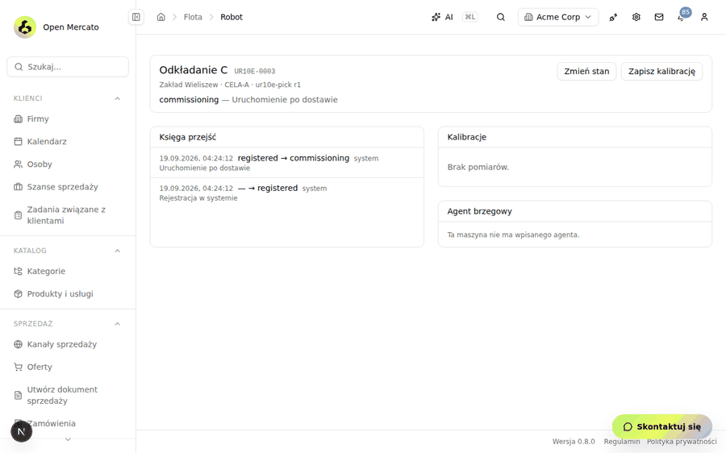

Nagranie z działającej instancji, bez montażu. Operator otwiera kartę robota
`UR10E-0003` (stan `commissioning`), wybiera stan docelowy `ready` i wpisuje
powód. Wtedy dzieją się trzy rzeczy, po kolei:

1. **Pojawia się brama podpisu.** Dopuszczenie maszyny do pracy to nie jest
   zmiana pola w formularzu: *„Biorę odpowiedzialność za dopuszczenie tej
   maszyny. Mój identyfikator zostanie zapisany w księdze przejść."* Bez
   zaznaczenia przycisk „Zatwierdź" pozostaje nieaktywny.
2. **Powód jest obowiązkowy** i - jak mówi etykieta - *„trafia do księgi
   przejść i zostaje tam na stałe"*.
3. **Serwer odmawia, podając konkretny brak:**

> **Nie można dopuścić robota: brak ważnej kalibracji: `camera_extrinsics`,
> `tool_center_point`.**

Tekst odmowy nie jest kodem błędu ani ogólnikiem „operacja niedozwolona".
Wymienia **dokładnie te dwie kalibracje**, których brakuje, więc brygadzista
wie, co ma zrobić, zamiast szukać administratora. Reguła jest po stronie
serwera, nie w przeglądarce - ten sam `HTTP 422` dostanie skrypt, integracja
i każdy inny klient.

### Pulpit dyrektora - cały zakład na jednym ekranie

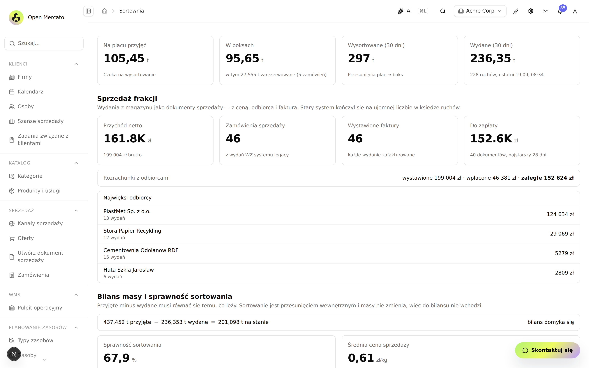

Cztery liczby u góry to stan fizyczny zakładu, cztery poniżej - stan
finansowy. Trzy rzeczy, których stary system nie umiał pokazać:

- **bilans masy domyka się co do kilograma** - 437,452 t przyjęte − 236,353 t
  wydane = 201,098 t na stanie. W starym systemie księga ruchów potrafiła zejść
  poniżej zera i nikt się o tym nie dowiadywał przed załadunkiem;
- **rozrachunki** - wystawione 199 004 zł, wpłacone 46 381 zł, **zaległe
  152 624 zł**. Tej liczby nie było gdzie zobaczyć;
- **sprawność sortowania 67,9%** i **średnia cena 0,61 zł/kg** - dwie miary,
  które zamieniają „ile przerobiliśmy" na „ile na tym zarobiliśmy".

### Rzut hali - maszyny w skali, z powodem odmowy na wierzchu

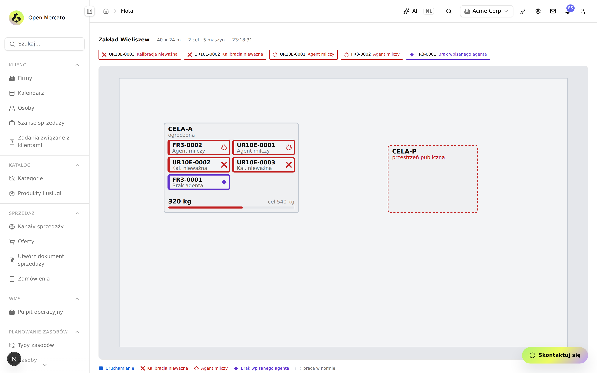

Zakład Wierzbowo, 40 × 24 m, dwie cele, pięć maszyn - **rysowane w skali
z rzeczywistych wymiarów**, a nie jako ikonki na siatce. Pasek alarmów u góry
jest tu najważniejszy: z pięciu maszyn **żadna nie pracuje**, i każda ma
wypisany powód:

| Chip | Znaczenie |
| --- | --- |
| `UR10E-0002`, `UR10E-0003` - **Kalibracja nieważna** | maszyna sprawna, ale nie ma ważnego dowodu kalibracji, więc nie wolno jej dopuścić |
| `UR10E-0001`, `FR3-0002` - **Agent milczy** | brak uderzenia serca w terminie - nie wiadomo, co robi |
| `FR3-0001` - **Brak wpisanego agenta** | maszyna jest w rejestrze, ale nie ma tożsamości kryptograficznej |

To jest cała teza projektu na jednym ekranie: **system nie zgaduje i nie
udaje, że jest dobrze.** Cela `CELA-A` jest ogrodzona i ma 320 kg z celu
540 kg; `CELA-P` to przestrzeń publiczna - inna klasa ryzyka, inne wymagania
dopuszczenia.

### Rejestr floty - właściciel i operator to dwie różne rzeczy

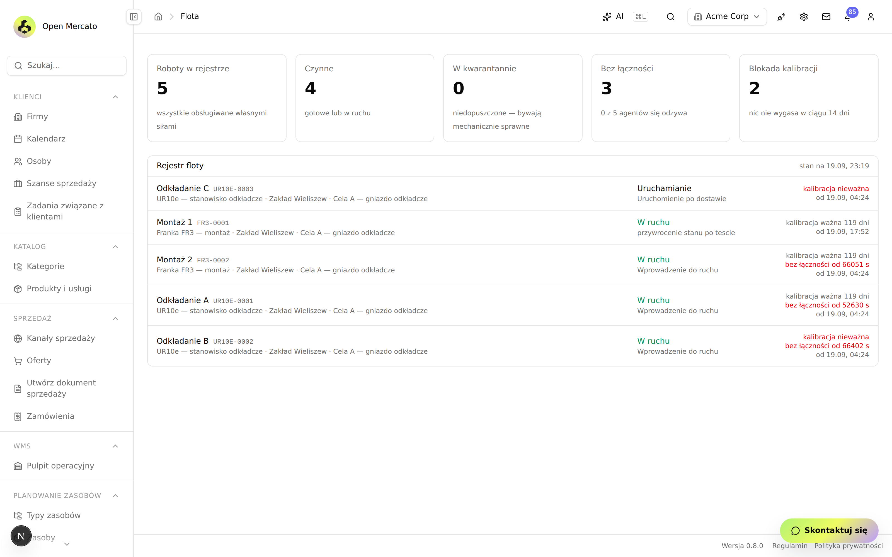

Pięć maszyn, cztery czynne, **trzy bez łączności i dwie z blokadą
kalibracji**. Każdy wiersz mówi nie tylko „jaki stan", ale **od kiedy i na
jakiej podstawie**: „kalibracja ważna 119 dni", „bez łączności od 66 402 s",
„Uruchomienie po dostawie". Ostatnia kolumna to powód przejścia wpisany przez
człowieka, który je zatwierdził.

Rozdział **właściciel / operator** nie jest kosmetyką: integrator widzi
maszyny, które serwisuje, a nie jest ich właścicielem; właściciel widzi swoje,
choć obsługuje je ktoś inny.

### Cyfrowy bliźniak - pomieszczenie odtworzone ze skanu LiDAR i filmu

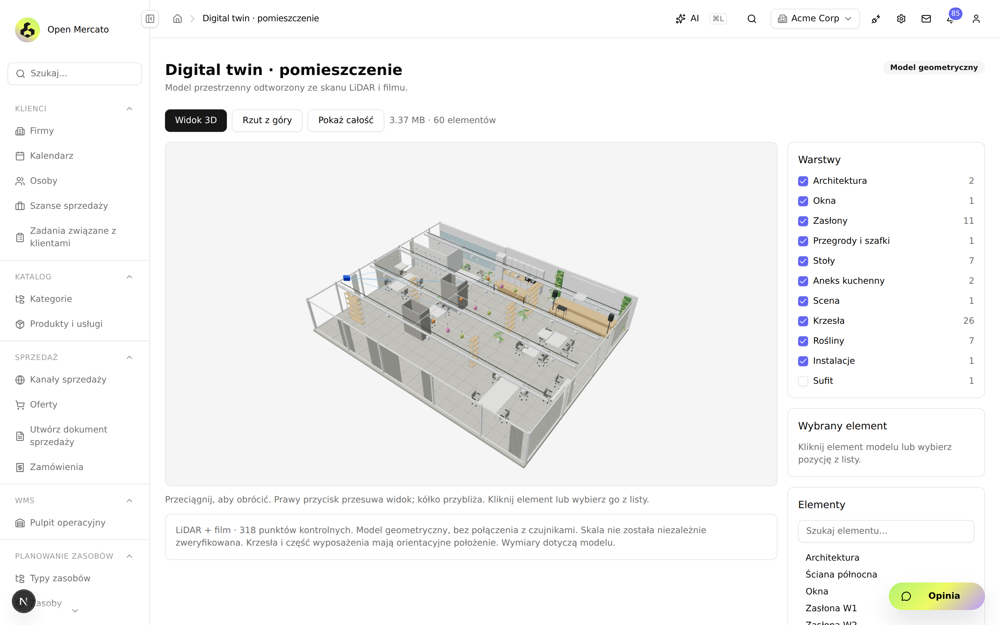

Model przestrzenny zbudowany z **318 punktów kontrolnych** (LiDAR + film),
60 elementów w 11 warstwach, obracany i klikalny w przeglądarce. Każdy element
można wskazać i odczytać jego wymiary.

Zwróćcie uwagę na ramkę pod widokiem - to nie jest ozdobnik, tylko zasada,
którą trzymamy w całym projekcie: *„Model geometryczny, bez połączenia
z czujnikami. **Skala nie została niezależnie zweryfikowana.** Krzesła i część
wyposażenia mają orientacyjne położenie."* System mówi, czego o sobie nie wie.

### Most hala ↔ ERP - **kilogramy z wagi, nie z deklaracji**

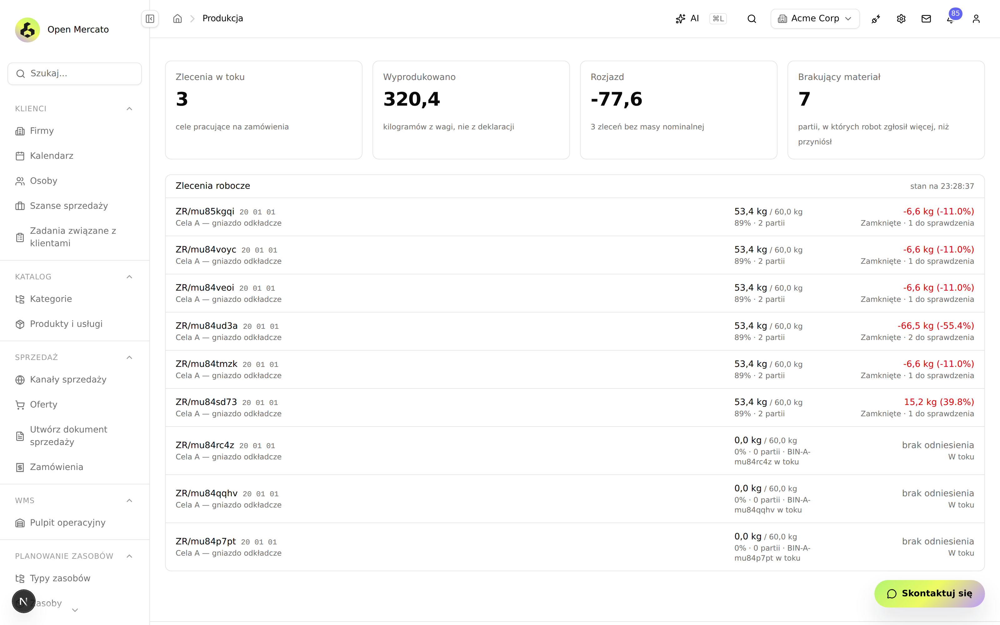

Podpis pod drugim kafelkiem jest całą zasadą tego modułu: *„320,4 kilogramów
**z wagi, nie z deklaracji**"*. Robot deklaruje; waga rozstrzyga; do magazynu
wchodzi waga.

Kolumna po prawej to różnica między jednym a drugim, liczona per zlecenie:
`-6,6 kg (-11,0%)` przy pięciu zleceniach, `-66,5 kg (-55,4%)` przy jednym
i `+15,2 kg (+39,8%)` przy jeszcze innym. Kafelek *„Brakujący materiał: 7"*
liczy **partie, w których robot zgłosił więcej, niż przyniósł** - i to jest
ocena robota, nie magazynu. Zlecenia bez zamkniętej partii mają uczciwe
*„brak odniesienia"* zamiast wyliczonego zera.

### Trzeci świadek - kto się myli, robot czy waga?

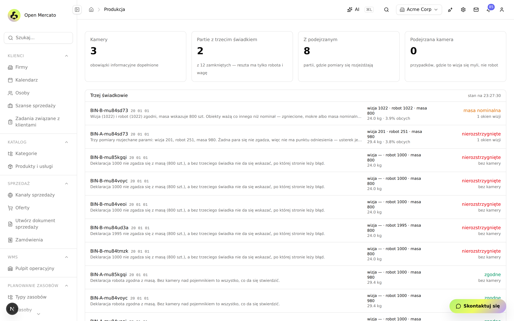

Most hala ↔ ERP ma jeden trudny problem: **robot deklaruje, ile przesortował,
a waga mówi co innego.** Sama para „robot kontra waga" nie wystarcza - wiadomo,
że się nie zgadzają, ale nie wiadomo, kto się myli. Dlatego kamera jest
**trzecim świadkiem**, a ekran pokazuje dokładnie tę logikę:

| Wiersz | Werdykt |
| --- | --- |
| *„Wizja (1022) i robot (1022) zgodni, masa wskazuje 800 szt."* | **masa nominalna** - to nie błąd liczenia, tylko obiekty ważą co innego niż nominał (zgniecione, mokre) |
| *„Deklaracja 1000 nie zgadza się z masą (800 szt.), a bez trzeciego świadka nie da się wskazać, po której stronie leży błąd"* | **nierozstrzygnięte - bez kamery** |
| *„Trzy pomiary rozjechane parami: wizja 201, robot 251, masa 980. Żadna para się nie zgadza, więc nie ma punktu odniesienia"* | **nierozstrzygnięte** |
| *„Deklaracja robota zgodna z masą. Bez kamery nad pojemnikiem to wszystko, co da się stwierdzić"* | **zgodne** |

System nie udaje, że rozstrzygnął, gdy nie ma czym. **Do magazynu i tak
wchodzi liczba z wagi** - rozbieżność jest oceną robota, nie magazynu.

### Macierz dopuszczeń - **odmowa zawsze ma nazwany powód**

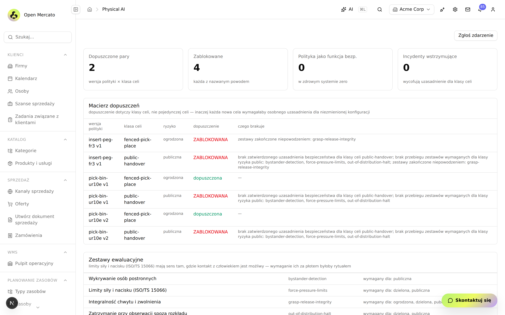

Jeśli jeden ekran ma pokazać, o co w tym projekcie chodzi, to ten. Dwie pary
dopuszczone, **cztery zablokowane - i przy każdej napisane, czego brakuje**:

- `insert-peg-fr3 v1` × cela ogrodzona → *zestawy zakończone niepowodzeniem:
  grasp-release-integrity*;
- `pick-bin-ur10e v1` × przestrzeń publiczna → *brak zatwierdzonego
  uzasadnienia bezpieczeństwa dla klasy celi public-handover; brak przebiegu
  zestawów wymaganych dla klasy ryzyka public: bystander-detection,
  force-pressure-limits, out-of-distribution-halt*.

Trzy rzeczy, które ta tabela wymusza:

1. **Dopuszczenie dotyczy klasy celi, nie pojedynczej celi** - inaczej każda
   nowa cela wymagałaby osobnego uzasadnienia dla niezmienionej konfiguracji.
2. **Wymagania zależą od klasy ryzyka.** Limity siły i nacisku (ISO/TS 15066)
   mają sens tam, gdzie kontakt z człowiekiem jest możliwy - wymaganie ich za
   płotem byłoby rytuałem.
3. **„Polityka jako funkcja bezpieczeństwa: 0"** i podpis *„w zdrowym systemie
   zero"*. Ustawienie tej flagi blokuje dopuszczenie niezależnie od wszystkich
   zaliczonych testów - bo wpycha maszynę w Annex I część A rozporządzenia
   (UE) 2023/1230, czyli w ocenę przez jednostkę notyfikowaną, dla której nie
   ma ustalonej metody wykazania zgodności.

### Wdrożenia - maszyna staje sama, gdy centrala zamilknie

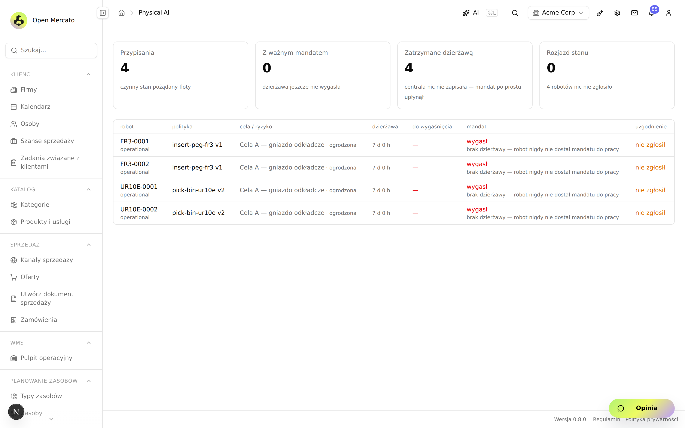

ERP publikuje **stan pożądany**, a robot pobiera go na czas ograniczony
**dzierżawą** i raportuje, co faktycznie robi. Ten zrzut pokazuje sytuację,
którą trzeba było zaprojektować, zanim się wydarzy: cztery przypisania, **zero
z ważnym mandatem**, cztery *zatrzymane dzierżawą* - *„centrala nic nie
zapisała, mandat po prostu upłynął"*.

To jest różnica między „fail-open" a „fail-closed". Gdyby stan pożądany był
poleceniem bez terminu ważności, awaria łącza zostawiłaby cztery maszyny
pracujące bez nadzoru. Tu maszyna zatrzymuje się sama, a operator widzi dokładny
powód, zamiast zgadywać.

Rozjazd między tym, co robot ma robić, a tym, co robi, jest wykrywany **zboczem** -
ogłaszany raz, przy zmianie, a nie przy każdym raporcie. Raporty przychodzą
z częstotliwością maszynową; alarm powtarzany co kilkadziesiąt sekund przez cały
czas trwania awarii przestaje być alarmem.

### Rejestr polityk - **tożsamością jest skrót artefaktów, nie numer**

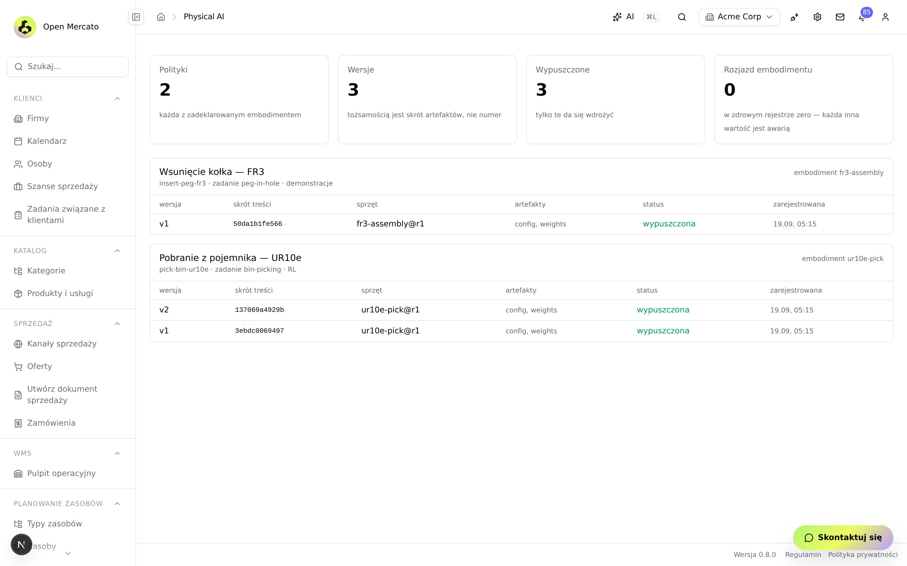

Podpisy pod kafelkami są tu ważniejsze niż same liczby:

- *„tożsamością jest skrót artefaktów, nie numer"* - `v2` z odciskiem
  `137069a4929b` to konkretne wagi, nie etykieta, którą ktoś może przykleić do
  innego pliku;
- *„Wypuszczone: tylko te da się wdrożyć"* - status jest bramką, nie opisem;
- *„Rozjazd embodimentu: w zdrowym rejestrze zero - każda inna wartość jest
  awarią"*. Rozjazd znaczy, że polityka była uczona pod inny kontrakt sprzętu,
  niż ten, na którym ma pracować. Nie ostrzegamy - pokazujemy to jako liczbę,
  która **ma być zerem**.

Kolumna `sprzęt` (`ur10e-pick@r1`) wiąże wersję z **konkretną rewizją**
embodimentu. To jest jedyna rzecz, której nie widać w żadnym repozytorium
modeli: czy ta polityka ma pod sobą sprzęt, na którym wolno ją uruchomić.

### Epizody i interwencje - jedna liczba, która mówi, czy idzie do przodu

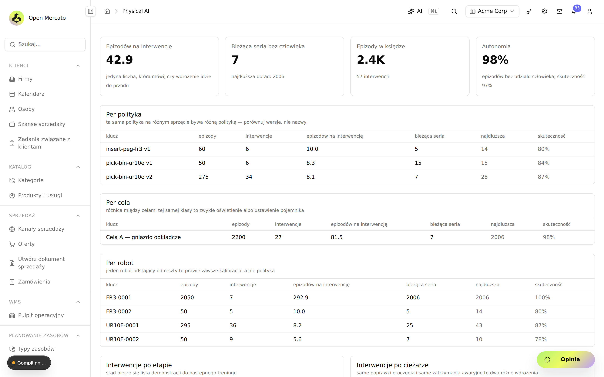

**2,4 tys. epizodów, 57 interwencji, 42,9 epizodu na interwencję, 98%
autonomii.** Podpis pod pierwszym kafelkiem nie jest ozdobnikiem: *„jedyna
liczba, która mówi, czy wdrożenie idzie do przodu"*. Liczba epizodów rośnie
zawsze; liczba interwencji na epizod rośnie tylko wtedy, gdy jest lepiej.

Rozbicia poniżej są tam, gdzie zwykle leży przyczyna:

| Rozbicie | Po co | Co widać na zrzucie |
| --- | --- | --- |
| **per polityka** | *ta sama polityka na różnym sprzęcie bywa różną polityką* | `pick-bin-ur10e v2`: 275 epizodów, 8,1 na interwencję, skuteczność 87% |
| **per cela** | *różnica między celami tej samej klasy to zwykle oświetlenie albo ustawienie pojemnika* | Cela A: 2200 epizodów, 81,5 na interwencję |
| **per robot** | *jeden robot odstający od reszty to prawie zawsze kalibracja, a nie polityka* | `UR10E-0002`: 5,6 na interwencję przy 8,2 u bliźniaka `UR10E-0001` |

Interwencje są też rozbite **po etapie** (*„stąd bierze się lista demonstracji
do następnego treningu"*) i **po ciężarze** (*„same poprawki otoczenia i same
zatrzymania awaryjne to dwa różne wdrożenia"*) - bo jeden próg na wszystko
zrównuje dojrzałość z zagrożeniem.

### Wdrożenie etapowe - brama, która wycofuje **bez pytania człowieka**

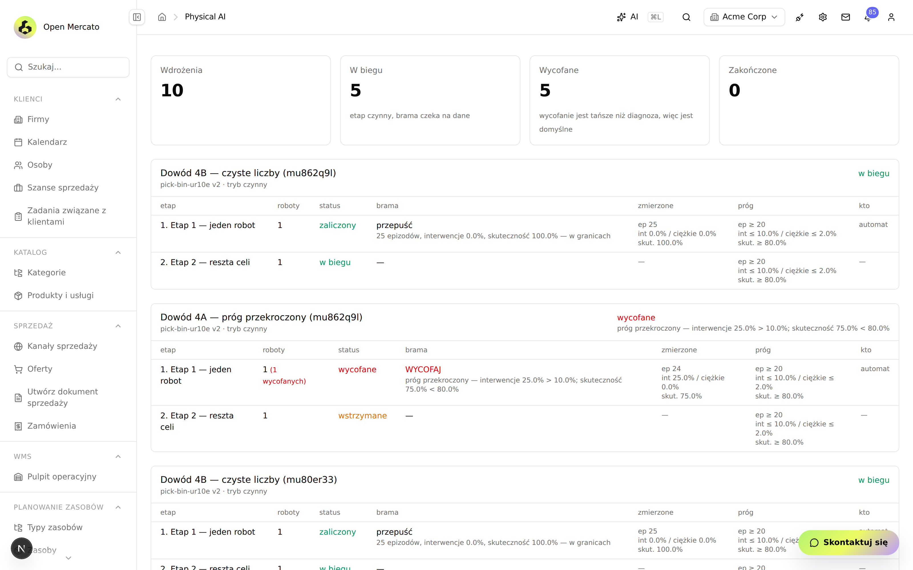

Dziesięć wdrożeń, pięć w biegu, **pięć wycofanych**. Najciekawszy jest wiersz
`Dowód 4A`:

> **WYCOFAJ** - *próg przekroczony: interwencje 25,0% > 10,0%; skuteczność
> 75,0% < 80,0%.* Kolumna „kto": **automat**. Etap 2: **wstrzymane**.

Obok, dla kontrastu, `Dowód 4B`: *„25 epizodów, interwencje 0,0%, skuteczność
100,0% - w granicach"* → **przepuść**.

Trzy reguły, które ta tabela wymusza:

1. **Brama odwołuje się do liczb z księgi epizodów, nie do opinii.** Nie ma tu
   pola „zatwierdził kierownik". Człowiek może zatrzymać wdrożenie w każdej
   chwili, ale nie może go przepchnąć obok liczb.
2. **Wycofanie jest tańsze niż diagnoza, więc jest domyślne** - podpis pod
   kafelkiem „Wycofane" mówi to wprost. Przy przekroczeniu progu nie
   wstrzymujemy do wyjaśnienia; wycofujemy i wyjaśniamy potem.
3. **Za mało danych to nie jest zgoda.** Etap poniżej progu 20 epizodów
   dostaje `hold`, nie `advance`.

---

## Efekt finansowy

Nie podajemy jednej liczby „oszczędności", bo byłaby zmyślona. Podajemy
**model z jawnymi wejściami**: to, co system już mierzy, jest wypełnione
wartościami z żywej instancji; to, co musi podać zakład, jest oznaczone jako
parametr. Dyrektor zakładu może policzyć własny wynik w pięć minut.

### Źródło 1 - należności, których nie było gdzie zobaczyć

Stary system kończył ewidencję na wydaniu z magazynu. Nie wiedział, czy
faktura została zapłacona.

| Wielkość | Wartość zmierzona | Źródło |
| --- | --- | --- |
| Wystawione | 199 004 zł | pulpit, rozrachunki |
| Wpłacone | 46 381 zł | pulpit, rozrachunki |
| **Zaległe** | **152 624 zł** | 40 dokumentów, najstarszy 28 dni |

Efekt nie polega na tym, że pieniądze się pojawiają - tylko na tym, że
**wiadomo, u kogo leżą i od jak dawna**. Przy koszcie kapitału `k` (parametr
zakładu) i skróceniu średniego wieku należności o `d` dni, roczna korzyść to
mniej więcej `152 624 zł × k × d / 365`. Dla `k = 8%` i `d = 14` daje to około
**468 zł rocznie na obecnym wolumenie** - i skaluje się wprost proporcjonalnie
do obrotu. Dla zakładu obracającego 20 mln zł rocznie ten sam mechanizm to
rząd wielkości **kilkudziesięciu tysięcy złotych**.

### Źródło 2 - załadunek bez pokrycia

System odmawia rezerwacji, gdy w magazynie nie ma masy. W przebiegu
weryfikacyjnym **5 zamówień dostało rezerwację na 27,555 t, a jedno zostało
odrzucone z braku pokrycia** - czyli jeden załadunek, który w starym systemie
wyjechałby po towar, którego nie ma.

Koszt jednego nieudanego załadunku = `transport w obie strony` + `przestój
naczepy` + `koszt relacji z odbiorcą`. **Świadomie nie podstawiamy tu własnej
liczby** - stawka za kurs zależy od dystansu, taryfy przewoźnika i tego, czy
naczepa jest własna. Zakład zna te trzy wielkości i podstawia je sam.

Częstotliwość zdarzenia natomiast **zmierzyliśmy**: 1 na 6 otwartych zamówień
w przebiegu weryfikacyjnym. Jeśli u kogoś wychodzi 1 na 50, oszczędność jest
odpowiednio mniejsza - i to też jest wynik, bo znaczy, że ewidencja działała.

### Źródło 3 - identyfikowalność partii

Każde przyjęcie zakłada partię z dostawcą i datą. 109 partii w bazie, każdy
ruch magazynowy wskazuje partię. To jest warunek, a nie wygoda:

- **reklamacja frakcji** - odbiorca zwraca partię zanieczyszczoną; bez
  identyfikowalności koszt bierze na siebie sortownia, z nią wraca do dostawcy;
- **karta przekazania odpadu** - 40 kart, 0 niekompletnych. Brak danych na
  karcie to ryzyko administracyjne po stronie zakładu;
- **wycena per dostawca** - widać, który dostawca przywozi masę o jakiej
  wartości wyjściowej (0,61 zł/kg średnio, od 0,03 do 1,55 zł/kg zależnie od
  frakcji).

### Źródło 4 - warstwa Physical AI

Tu efekt jest **warunkowy i jeszcze nieudowodniony** - piszemy to wprost.
Roboty sortujące zwiększają przepustowość linii, ale w tym hackathonie nie
zamknęliśmy autonomicznego chwytu (patrz sekcja o tym, czego nie zdążyliśmy).
To, co platforma daje **już teraz, niezależnie od skuteczności robota**, to:

- **dopuszczenie maszyny do pracy jest decyzją z podpisem i datą**, a nie
  ustaleniem ustnym - co przy rozporządzeniu maszynowym (UE) 2023/1230
  (obowiązuje od 20 stycznia 2027) jest różnicą między dokumentacją a jej
  brakiem;
- **wdrożenie nowej wersji sterownika wycofuje się samo**, gdy udział
  interwencji ciężkich przekroczy próg - zamiast pracować na podejrzanej
  polityce przez czas trwania dochodzenia;
- **nagrania z osobą w kadrze mają wymuszoną retencję trzymiesięczną**
  (art. 22² Kodeksu pracy) - alarm o przeterminowanym klipie nie cichnie sam.

Wartość tych trzech pozycji to koszt unikniętego zdarzenia (wypadek, kara,
wstrzymanie linii przez inspekcję), którego prawdopodobieństwa nie znamy i nie
będziemy zmyślać. Znamy natomiast koszt ich braku: w razie wypadku pytanie
„która wersja sterownika pracowała i kto ją dopuścił" musi mieć odpowiedź.

---

## Co jest w tym repozytorium

Symulator systemu legacy (Python), **piętnaście modułów Open Mercato**
(TypeScript), narzędzie fizycznego odbioru ramienia SO-101 (Python)
i dokumentacja decyzji projektowych. Repozytorium **nie zawiera samej
platformy** - moduły kopiuje się do klonu Open Mercato skryptem
`mercato/install.sh`.

---

# Dokumentacja techniczna

Od tego miejsca zaczyna się pełny opis techniczny. Wszystko, co jest niżej,
powstało w trakcie hackathonu 18-19 września 2026; commity i ich kolejność są
w historii `git log`.

## Po co to powstało

Sortownia pracuje na systemie, który wie tylko tyle, ile wiedział webERP:
kontrahent, frakcja, lokalizacja, ruch magazynowy w kilogramach. Nie wie,
ile boks może pomieścić, czyj odpad w nim leży, czy zamówienie ma pokrycie
w magazynie, ani czy faktura została zapłacona. Księga ruchów potrafi zejść
poniżej zera i nikt się o tym nie dowie przed załadunkiem.

Równolegle na halę wchodzą roboty sortujące, których sterowanie jest wyuczone,
a nie zaprogramowane. Trzy akty prawne rozstrzygają, co wolno, a czego nie:

| Akt | Co z niego wynika dla hali | Od kiedy |
| --- | --- | --- |
| **Rozporządzenie (UE) 2023/1230** o maszynach, Annex I część A | maszyna, w której funkcję bezpieczeństwa pełni element uczący się, trafia do oceny przez jednostkę notyfikowaną | 20 stycznia 2027 |
| **Rozporządzenie (UE) 2024/1689** (AI Act), art. 5 ust. 1 lit. f) i g) | zakaz rozpoznawania emocji w miejscu pracy i kategoryzacji biometrycznej wg cech wrażliwych | 2 lutego 2025 |
| **Kodeks pracy, art. 22²** § 1 i § 3 | zamknięty katalog celów monitoringu i **trzymiesięczny limit retencji** nagrań | obowiązuje |

Każdy z nich jest w kodzie bramką, nie akapitem w polityce firmy. Regulator, odbiorca frakcji i ubezpieczyciel będą pytać: która
wersja sterownika pracowała na której maszynie, kto ją dopuścił, na jakiej
podstawie, ile razy człowiek musiał interweniować i co się stało z nagraniem.

Projekt odpowiada na obie potrzeby jedną platformą:

| Warstwa | Co daje zakładowi | Czego nie robi |
| --- | --- | --- |
| Most do systemu legacy | migrację bez zatrzymania produkcji: dane płyną dwoma kanałami tak, jak z prawdziwego webERP, import jest powtarzalny i nie dubluje | nie zastępuje starego systemu od razu; nie pisze do niego |
| Ewidencja w Open Mercato | pojemność boksów, partie z dostawcą, rezerwacje z odmową przy braku pokrycia, faktury i wpłaty powiązane z zamówieniem, karty przekazania odpadu dla wydań, które zaszły, bilans masy co do kilograma | nie łączy się z rządowym BDO; nie prowadzi księgi zakupów |
| Warstwa Physical AI | audytowalny zapis: która polityka, na której maszynie, pod jakim uzasadnieniem bezpieczeństwa, z jakim wynikiem; wdrożenia etapowe z automatycznym wycofaniem; dane korekcyjne do następnego treningu | nie steruje robotem, nie uczy polityki, nie zatrzymuje maszyny - to robi deterministyczna warstwa bezpieczeństwa poza platformą |
| Most hala ↔ ERP | praca robota staje się stanem magazynu, ale w masie z wagi; robot, który gubi materiał, dostaje flagę, a magazyn prawdę | nie zleca pracy z zamówień; nie rozdziela materiału między pojemniki |

## Kto z tego korzysta

| Rola | Co widzi i co może | Gdzie |
| --- | --- | --- |
| Dyrektor zakładu | bilans masy, sprawność sortowania, przychód per frakcja, rozrachunki z odbiorcami, zapełnienie boksów, najwięksi odbiorcy i dostawcy | `/backend/sortownia`, kafelki pulpitu głównego |
| Brygadzista, operator hali | rzut hali w skali, stan i łączność każdego robota, przejścia stanu z własnym podpisem (dopuszczenie, kwarantanna), ważenie partii, zgłoszenie incydentu bez pytania przełożonego | `/backend/plant`, `/backend/fleet/<id>`, `/backend/work_orders`, `/backend/safety` |
| Księgowość, handel | faktury wystawione z zamówień, wpłaty alokowane na faktury, wiek należności, karty przekazania, firmy i szanse sprzedaży spójne ze sobą | moduły `sales` i `customers` platformy |
| Inżynier robotyki | rejestr wersji polityk, dzierżawy, kadencja interwencji, wdrożenia etapowe z bramą, zbiory treningowe z pochodzeniem, plan obciążenia węzła obliczeniowego | `/backend/policies`, `/backend/deployment`, `/backend/episodes`, `/backend/rollout`, `/backend/datasets`, `mercato compute plan` |
| BHP, pełnomocnik ds. zgodności | uzasadnienia bezpieczeństwa per klasa celi, zestawy ewaluacyjne, incydenty z klasyfikacją, retencja nagrań, odmowy zakazanych klas detekcji | `/backend/safety`, `/backend/vision` |
| IT | instalacja modułów, migracje, harmonogramy, kafelki, 59 typowanych zdarzeń do automatyzacji workflow | `mercato/install.sh`, CLI, `GET /api/events` |

## Architektura

Trzy światy, cztery grupy modułów, jeden rdzeń. Trzy rodzaje strzałek, bo to
trzy różne mechanizmy:

| Strzałka | Znaczy | Przykład |
| --- | --- | --- |
| `==>` | HTTP z hali, bez sesji użytkownika, podpis Ed25519 | agent → `POST /api/edge/heartbeat` |
| `-->` | komenda przez szynę Open Mercato: dziennik audytu, zdarzenia, indeks wyszukiwania | `deployment` → `safety.clearance.check` |
| `-.->` | odczyt encji innego modułu, bez zapisu | `rollout` czyta księgę `episodes` |


Kierunek strzałek jest kierunkiem zależności. Moduły warstwy Physical AI nie
dotykają `wms`, `catalog` ani `sales`; do magazynu piszą wyłącznie dwa mosty:
`sortownia` (z księgi legacy) i `work_orders` (z wagi). Zdarzenia trafiają na
szynę i nie mają dziś subskrybenta - kanał jest gotowy na automatyzacje,
obieg „zdarzenie → reakcja" nie jest jeszcze obserwowalny.

### Mapa repozytorium

```
openmercato_garbagekind/
├── LICENSE            Apache-2.0
├── NOTICE             składniki obce i ich licencje; nota o danych fikcyjnych
├── CONTRIBUTING.md    procedura i zasady inżynierskie obowiązujące w repozytorium
├── SECURITY.md        zgłaszanie podatności, model zagrożeń kanału brzegowego
├── run_demo.sh        generator → serwer → spooler → klient pełny → przyrostowy
│
├── legacy/            symulator starego systemu: schema.sql, generate.py,
│                      server.py (XML-RPC), spooler.py, xlsx.py
├── client/            weberp_sync.py - XML-RPC + wsad/ → out/*.csv
├── webui/             simag.html - makieta ekranu starego systemu (SIMAG 3.11)
├── tests/             zestaw pythonowy: kanał legacy, paczka dowodowa,
│                      odbiór SO-101, protokół i zgodność agenta brzegowego
│
├── mercato/
│   ├── install.sh     kopiuje moduły do klonu Open Mercato i włącza je w modules.ts
│   ├── README.md      moduł sortownia w szczegółach
│   ├── modules/       15 modułów - mapa i zależności w modules/README.md
│   ├── embodiments/   so101_follower.json - kontrakt sprzętowy manipulatora
│   └── hardware/
│       ├── so101/     narzędzie odbioru fizycznego, sterowanie ruchem, serwer MCP
│       └── edge_agent/ agent referencyjny kanału brzegowego + zestaw zgodności
│
├── physical-ai/       decyzje projektowe, mapa faz, kontrakty, materiał dowodowy
├── docs/
│   ├── handoff/       warunki odbioru fizycznego SO-101
│   └── screenshots/   zrzuty z uruchomionej instancji
└── .github/           CI i szablony
```

Każdy moduł ma ten sam szkielet: `index.ts`, `acl.ts`, `setup.ts`,
`data/entities.ts`, `migrations/`, `commands/`, `events.ts`, `api/`,
`backend/<ekran>/page.tsx`, `widgets/`, `cli.ts`, `i18n/`, `__tests__/`,
`__integration__/`. Moduł bez własnego stanu nie ma pustych plików na pokaz:
`hmi` nie ma `events.ts`, `sortownia` nie ma `commands/`.

## Most do systemu legacy

### Co to znaczy dla zakładu

Stary system zostaje w ruchu. Platforma czyta go tak, jak czytałaby prawdziwy
webERP - sześć metod XML-RPC, które w webERP istnieją, i pliki, które
w rzeczywistym wdrożeniu przychodzą z księgowości. Po zmianie jednego URL-a
ten sam klient zadziała przeciw produkcyjnej instancji. Import da się
uruchamiać wielokrotnie: drugi przebieg raportuje same duplikaty i nie
dopisuje ani jednego ruchu.

### Jak to działa

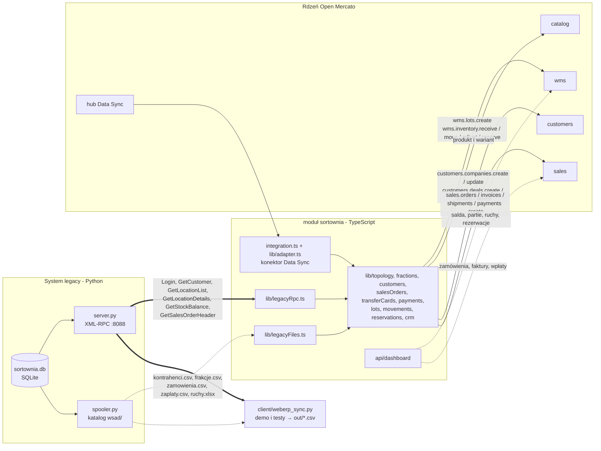

Symulator (`legacy/`) generuje powtarzalny zbiór: 8 kontrahentów, 6 frakcji,
6 lokalizacji, kilkaset ruchów historycznych i pulę ruchów przyszłych, które
spooler ujawnia z czasem - stąd żywa synchronizacja przyrostowa. Nazwy tabel
i kolumn są przepisane z webERP razem z jego dziwactwami (kontrahent to
`debtor`, wydanie ma ujemną ilość).

### Co dochodzi po drodze

| Legacy (webERP) | Open Mercato | Czego stary system nie miał |
| --- | --- | --- |
| `locations` | wms: magazyn, strefy, lokalizacje | pojemność boksu w kg - pasek zapełnienia, ostrzeżenie od 70 %, alarm od 90 % |
| `stockmaster` | catalog: produkt i wariant | kod odpadu jako SKU, kod procesu odzysku R1-R5, próg wysyłki z powiadomieniem `low_stock` |
| `debtorsmaster` | customers: firma | etap cyklu życia z roli (dostawca / klient), NIP i BDO, klucz idempotencji w polu `source` |
| - | customers: szansa sprzedaży | każdy odbiorca ma szansę `win` o wartości równej sumie brutto jego zamówień; dostawca nie ma żadnej |
| `stockmoves` PZ / SORT / WZ | `wms.inventory.receive` / `transfer` / `issue` | partia z dostawcą przy przyjęciu, para SORT jako jeden transfer, rozkład na partie FIFO, `stkmoveno` jako `referenceId` |
| `salesorders` | sales: zamówienie, faktura, wysyłka | VAT 23 %, numer faktury z generatora platformy, karta przekazania odpadu wyłącznie dla wydań, które zaszły |
| `debtortrans` | sales: wpłata z alokacją | saldo należności, wiek najstarszego niezapłaconego dokumentu |
| - | wms: rezerwacja | zamówienie otwarte blokuje masę; brak pokrycia to odmowa, nie cicha zgoda |

Kolejność importu wynika z zależności: zamówienie potrzebuje kontrahenta
i frakcji, karta przekazania potrzebuje zamówienia, wpłata potrzebuje faktury,
rezerwacja potrzebuje stanu:

```
topologia → frakcje → kontrahenci → zamówienia (+faktury)
          → karty przekazania → wpłaty → partie → księga ruchów → rezerwacje → CRM
```

Krok CRM (`lib/crm.ts`, także osobno `yarn mercato sortownia sync-crm`)
pilnuje, żeby zakładki „Firmy" i „Szanse sprzedaży" mówiły to samo: klient ma
szansę wygraną, potencjalny - otwartą, dostawca nie ma żadnej; w drugą stronę
wygrana szansa awansuje potencjalnego klienta na klienta.

### Pulpit dyrektora

`/backend/sortownia` liczy z encji WMS i sprzedaży, więc ekran nie może
rozjechać się z magazynem: masa na placu i w boksach, wysortowane i wydane
w 30 dni, przychód netto i brutto, faktury, saldo do zapłaty z wiekiem
należności, przychód i średnia cena per frakcja, bilans masy (przyjęte minus
wydane równa się temu, co leży - na żywych danych domyka się co do kilograma),
sprawność sortowania, karty przekazania, pochodzenie odpadu per dostawca,
zapełnienie lokalizacji, księga ruchów z numerem kwitu legacy. Magazyn liczy
w kilogramach, ekran pokazuje tony.

Szczegóły, w tym dwa błędy, które wyszły dopiero na żywych danych:
[`mercato/README.md`](mercato/README.md).

## Warstwa Physical AI

### Co to znaczy dla zakładu

Robot z wyuczonym sterowaniem to maszyna, której zachowanie zmienia się
z każdą wersją wag. Platforma nie próbuje tego zachowania kontrolować -
kontroluje, **co wolno uruchomić, gdzie i pod czyim podpisem**, i zapisuje,
co z tego wyszło. Cztery skutki praktyczne:

- Wersja polityki bez zatwierdzonego uzasadnienia bezpieczeństwa dla danej
  klasy celi nie da się przypisać do robota. Odmowa przychodzi z komendy
  przypisania, z nazwanym powodem.
- Wdrożenie nowej wersji idzie etapami; brama między etapami liczy z księgi
  epizodów, a przekroczenie progu wycofuje etap bez udziału człowieka. Nie ma
  uprawnienia „pomiń bramę".
- Robot w celi ogrodzonej pracuje dalej, gdy padnie łącze z centralą; robot
  w przestrzeni publicznej zatrzymuje się sam po 120 sekundach. Decyzja zapada
  lokalnie, z zegara.
- Każda interwencja człowieka jest rekordem: kto, kiedy, na jakim etapie,
  dlaczego. To jedyna liczba, która mówi, czy wdrożenie idzie do przodu, i
  jednocześnie najcenniejsze dane do następnego treningu.

### Łańcuch modułów

Osiem modułów w kolejności zależności; każde ogniwo działa bez tych poniżej:

```
fleet            co istnieje, gdzie stoi i czy wolno mu pracować
edge             kto się odzywa, czym to udowadnia, kiedy odezwał się ostatnio
policy_registry  co to za polityka i na jakim sprzęcie wolno ją uruchomić
safety           czy wolno ją uruchomić w tej KLASIE celi
deployment       ten robot ma uruchomić tę wersję, na tak długo
episodes         co zrobił i kto przerwał
rollout          iść dalej czy wycofać - z liczb księgi, nie z opinii
datasets         z jakich epizodów powstał zbiór i która polityka się na nim uczyła
```

Jeden wyjątek od jednokierunkowości: `deployment` woła
`safety.clearance.check` przed zapisem przypisania. Dopuszczenie jest warunkiem
wstępnym, nie skutkiem ubocznym.

| Moduł | Za co odpowiada | Tabele | Komendy | Zdarzenia | Testy | Ekran |
| --- | --- | ---: | ---: | ---: | ---: | --- |
| `fleet` | roboty, klasy sprzętowe, obiekty, cele, kalibracje z terminem ważności; właściciel osobno od operatora; geometria hali; akcje operatora z podpisem człowieka | 6 | 5 | 8 | 88 | `/backend/fleet`, `/backend/fleet/<id>`, `/backend/plant` |
| `edge` | tożsamość Ed25519 agenta, bilet wpisowy, sesje, uderzenia serca; żywotność liczona przy odczycie z `last_seen_at` | 4 | 7 | 7 | 55 | `/backend/edge` |
| `policy_registry` | wersje polityk identyfikowane skrótem artefaktów, wiązane z rewizją embodimentu, nie z robotem; `release` osobno od `manage` | 4 | 3 | 5 | 45 | `/backend/policies` |
| `safety` | uzasadnienie bezpieczeństwa per klasa celi z rodzajem warstwy ze słownika, zestawy ewaluacyjne, incydenty klasyfikowane z faktów; odmowa dla polityki zadeklarowanej jako funkcja bezpieczeństwa | 4 | 7 | 8 | 50 | `/backend/safety` |
| `deployment` | przypisanie wersji do robota i dzierżawa: `fenced` 7 dni, `shared` 8 h, `public` 120 s; uzgodnienie stanu z trzecim werdyktem `unknown` | 3 | 4 | 4 | 45 | `/backend/deployment` |
| `episodes` | epizod jako atom pracy, interwencja jako własna tabela; raport epizodów między interwencjami sprawdzany krzyżowo z księgą | 2 | 3 | 4 | 40 | `/backend/episodes` |
| `rollout` | wdrożenia etapowe z bramą na liczbach; wycofanie domyślne; dziennik bramy ze sprawcą (automat albo człowiek) | 4 | 3 | 5 | 37 | `/backend/rollout` |
| `datasets` | wersje zbiorów budowane z księgi po kryteriach, role `demo`/`correction`/`failure`/`holdout`, przebiegi treningowe zamykające pętlę w obie strony | 4 | 4 | 4 | 44 | `/backend/datasets` |

Faza jest zamknięta, gdy zdanie o zachowaniu systemu zachodzi na żywej
instancji, nie gdy suita jest zielona. Każdy moduł ma komendę `prove`;
przebiegi i tabele odrzuconych alternatyw są w `physical-ai/README.md`.

### Agent na robocie: od biletu do ciszy

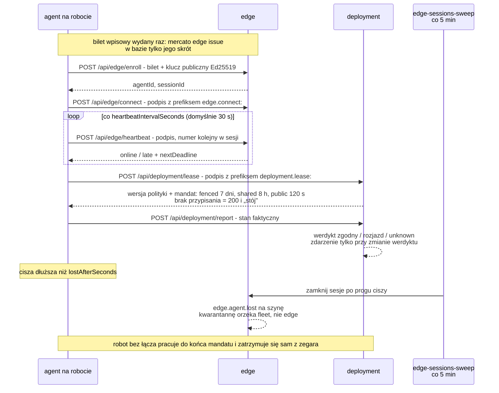

Powtórka numeru kolejnego, obcy klucz i bilet użyty drugi raz odbijają się
jako 401. Heartbeat nie generuje zdarzenia; faktem jest dopiero jego brak.

### Od wgrania wag do nowej wersji

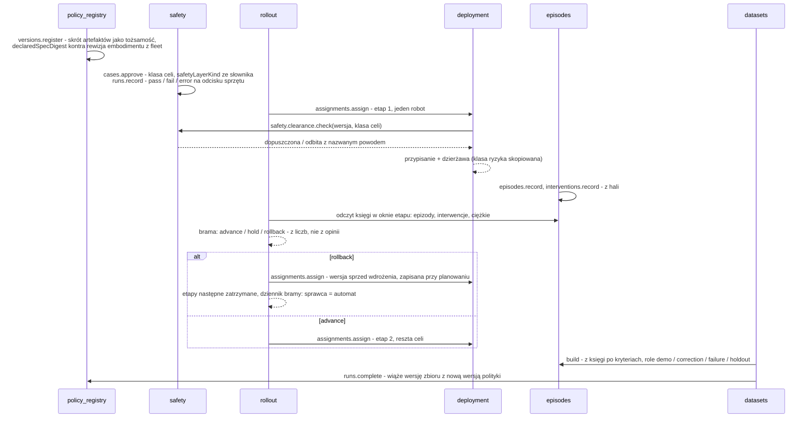

Wiązanie zbiór ↔ polityka powstaje wyłącznie przy domknięciu przebiegu
treningowego; przebieg udany bez wskazanej polityki jest odrzucany. Dzięki
temu regres jakości po treningu da się przypisać albo danym, albo treningowi.

## Most hala ↔ ERP

### Co to znaczy dla zakładu

Robot mówi: 1000 udanych chwytów. Przy masie nominalnej 30 g to 30,00 kg.
Waga pod pojemnikiem mówi: 24,00 kg. Sześciu kilogramów nie ma, a w telemetrii
robota nie widać po nich śladu. To jedyne miejsce w projekcie, w którym zdanie
maszyny o własnej pracy jest konfrontowane z czymś spoza maszyny.

- Do magazynu idzie masa z wagi, nigdy deklaracja robota. Robot gubiący co
  dziesiątą sztukę nie zamieni swojego błędu w stan magazynowy.
- Rozjazd nie wstrzymuje przyjęcia - materiał fizycznie istnieje. Werdykt
  `overclaim` podnosi flagę na maszynę i kieruje do niej człowieka.
- Most jest jednokierunkowy: epizody → masa. Zamówienie sprzedaży nie zleca
  pracy robotowi, bo ERP ma opóźnienia i tryby awarii systemu ewidencyjnego,
  nie sterowania ruchem.

| Moduł | Za co odpowiada | Tabele | Komendy | Zdarzenia | Testy | Ekran |
| --- | --- | ---: | ---: | ---: | ---: | --- |
| `sortownia` | most legacy → WMS, katalog, CRM, sprzedaż, KPO; pulpit; konektor Data Sync; bez własnych komend | 0 | 0 | 0 | 245 | `/backend/sortownia` |
| `work_orders` | zlecenie, partia, masa z wagi kontra deklaracja robota; rachunek w gramach całkowitych | 3 | 4 | 5 | 28 | `/backend/work_orders` |
| `vision` | kamery z celem ustawowym, detektory z progiem ufności, okna zliczeń, retencja 90 dni, triangulacja trzech świadków | 4 | 6 | 7 | 57 | `/backend/vision` |
| `physical_management` | digital twin hali: warstwa wyłącznie odczytowa nad `fleet` i `vision` | 0 | 0 | 0 | 0 | `/backend/physical-management` |
| `hmi` | żetony, słownik stanów i elementy SVG ekranów operatorskich; norma szara, kolor tylko dla odstępstwa | 0 | 0 | 0 | 26 | biblioteka |
| `compute` | rejestr węzłów obliczeniowych i przypisań; przepustowość pamięci obowiązkowa; rola `safety_function` nie istnieje w słowniku | 2 | 2 | 2 | 20 | CLI |

### Partia na wadze


### Trzeci świadek

Dwóch świadków - deklaracja robota i waga - wystarcza, żeby stwierdzić, że
coś się nie zgadza. Trzech, żeby powiedzieć co. Kamera nad pojemnikiem jest
trzecim, niezależnym pomiarem:

| wizja | robot | masa | podejrzany |
| ---: | ---: | ---: | --- |
| 1000 | 1000 | 1000 | `none` |
| 1000 | 1000 | 800 | `nominal_mass` - sztuki lżejsze niż nominał, nie wina robota |
| 800 | 1000 | 800 | `grip_to_bin` - materiał ginie między chwytem a pojemnikiem |
| 800 | 1000 | 1000 | `vision` - kamera nie widzi, materiał jest |
| 1300 | 1000 | 1000 | `foreign_material` |
| 1000 | 700 | 1000 | `under_reporting` |
| 600 | 1000 | 1500 | `inconclusive` |

Prawdziwy powód, dla którego w sortowni stawia się kamerę nad pojemnikiem,
to zdanie „ta frakcja PET ma 4 % PCW". Odbiorca z takim wynikiem odeśle
transport, a spór będzie o to, czy zanieczyszczenie powstało u nas.
`contamination()` liczy udział obcych klas; pusty pojemnik daje `null`,
nie zero procent.

Platforma nie widzi ani jednej klatki. Wnioskowanie dzieje się na brzegu, do
ERP trafiają okna zliczeń i materiał dowodowy przez odniesienie, z terminem
usunięcia liczonym z kamery. Odmowy są odrzuceniem zapisu, nie ostrzeżeniem:
detektor ze słownikiem emocji lub biometrii (AI Act art. 5), kamera z celem
spoza katalogu art. 22² Kodeksu pracy, retencja ponad 90 dni, próg ufności
równy zeru. Klasa `person` przechodzi wyłącznie jako obecność.

### Digital twin hali

Dwa ekrany, zero własnych tabel, żadnego zmyślania.

`/backend/physical-management` to jeden endpoint odczytowy nad `fleet` i
`vision`: obiekt, cele z geometrią i klasą ryzyka, źródła wideo, anonimowe
zliczenia osób. Odpowiedź niesie deklarację `rawVideoStoredInErp: false`,
`biometricIdentityStored: false`. Stan kamery wynika z wieku ostatniego okna,
nie z flagi.

`/backend/plant` to rzut hali w skali. Cela bez kompletu współrzędnych nie
jest rysowana, tylko wypisana obok - zmyślona pozycja jest gorsza niż jej
brak, bo brak widać. Robot „w ruchu", o którym centrala nic nie wie od pół
godziny, wygląda inaczej niż robot w ruchu, który się odzywa: wypełnienie
mówi o stanie, pierścień o łączności, wykrzyknik o kalibracji. Stan normalny
jest szary; kolor jest zarezerwowany dla odstępstwa (ISA-101).

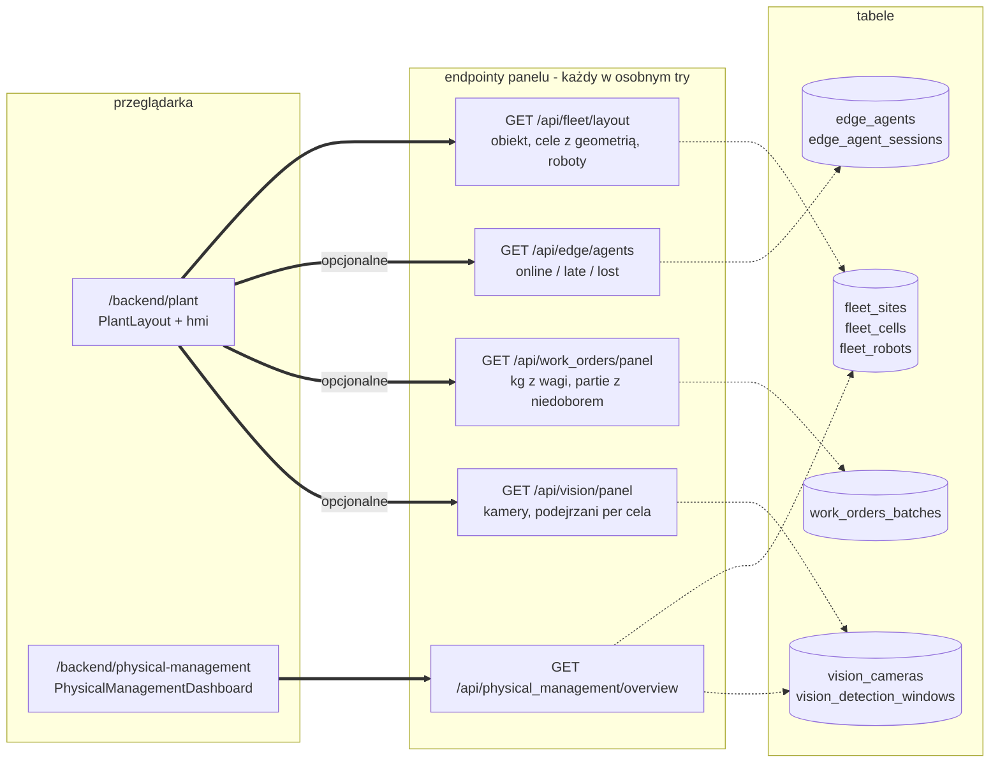

Trzy warstwy są opcjonalne: brak modułu albo uprawnienia odejmuje warstwę
informacji i jest wypisany w nagłówku, zamiast wywracać rysunek. Łączenie idzie
po identyfikatorze celi, nie po nazwie.

## Zgodność i bezpieczeństwo

| Wymóg | Podstawa | Jak platforma to wymusza |
| --- | --- | --- |
| Wyuczona polityka nie jest funkcją bezpieczeństwa | rozporządzenie (UE) 2023/1230, Annex I część A; AI Act art. 6 ust. 1 | uzasadnienie z `declaredAsSafetyFunction: true` nie daje się zatwierdzić; rola `safety_function` nie istnieje w słowniku `compute`; `safetyLayerKind` ze słownika zamkniętego (`hardware_estop`, `safety_plc`, `light_curtain`, …) |
| Dopuszczenie do ruchu ma podstawę i termin | ISO 10218-1/-2:2025, ISO/TS 15066:2016 | uzasadnienie per klasa celi z `valid_until`, zestawy ewaluacyjne wymagane per klasa ryzyka, liczy się najnowszy przebieg na tym samym odcisku sprzętu |
| Zakaz wnioskowania emocji i kategoryzacji biometrycznej w pracy | AI Act art. 5 ust. 1 lit. f i g (od 2 lutego 2025) | rejestracja detektora ze słownikiem zawierającym `emotion`, `face_id`, `gender`, … jest odrzucana; dopasowanie po rdzeniu słowa |
| Monitoring tylko w zamkniętym katalogu celów, nagrania niszczone po 3 miesiącach | art. 22² § 1 i § 3 Kodeksu pracy | kamera z celem spoza katalogu lub retencją > 90 dni jest odrzucana; worker oznacza materiał po terminie i ogłasza zaległość codziennie, dopóki bajty nie zostaną potwierdzone jako usunięte |
| Odpowiedzialność człowieka za dopuszczenie | - | przejście robota do ruchu wymaga `approvedBy` podanego z przeglądarki po świadomym potwierdzeniu; serwer nie podpisuje za nikogo |
| Incydent zgłaszany bez progu | - | `safety.incidents.report` ma każdy, kto stoi przy maszynie; ciężar klasyfikuje system z faktów, nie zgłaszający; incydent wstrzymujący wycofuje dopuszczenie dla całej klasy celi |

## Operacje

### Zadania cykliczne

| Moduł | Kolejka | Co ile | Co robi |
| --- | --- | --- | --- |
| `vision` | `vision-clips-purge` | 24 h | oznacza materiał po terminie ustawowym; bajtów nie kasuje, czeka na `vision.clips.confirm_deletion` od tego, kto je trzyma |
| `edge` | `edge-sessions-sweep` | 5 min | zamyka sesje agentów po progu ciszy i ogłasza `agent.lost`; nie kwarantannuje |
| `fleet` | `fleet-calibration-expiry` | 1 h | ogłasza wygaśnięcie kalibracji raz na kalibrację; nie zatrzymuje maszyn |

Wszystko, co platforma zasiewa przy inicjalizacji tenanta - uprawnienia ról,
harmonogramy, listy kafelków - jest dla modułu doinstalowanego później
niedostępne, a brak nie objawia się błędem, tylko ciszą. Stąd idempotentne
komendy `install-schedules` i `install-widgets`.

### Kafelki pulpitu głównego

`fleet.dashboard.readiness` (ile maszyn wolno uruchomić, ile w kwarantannie,
co blokuje resztę), `edge.dashboard.liveness` (kto się odzywa, kto milczy,
od kiedy), `safety.dashboard.clearance` (ile par polityka × klasa celi jest
dopuszczonych, ile zablokowanych).

### Zdarzenia

59 zdarzeń w 11 modułach, żadnego zadeklarowanego bez `emit` w kodzie, każde
z typowanym ładunkiem dla edytora workflow. Trzy reguły częstotliwości: ruch
nie jest faktem (heartbeat nie emituje, jego brak tak), wyzwalanie zboczem
(rozjazd trwający pół godziny to jedno zdarzenie), odhaczanie w danych
(wygaśnięcie kalibracji ogłaszane raz). Katalog:
`GET /api/events?module=<nazwa>` i [`physical-ai/EVENTS.md`](physical-ai/EVENTS.md).

### Wejścia agenta brzegowego

Jedyne endpointy bez sesji użytkownika - uwierzytelnienie podpisem Ed25519
kluczem, którego centrala nie ma:

```
POST /api/edge/enroll       edge.enroll:<token>:<odcisk klucza>
POST /api/edge/connect      edge.connect:<agentId>:<czas ISO>
POST /api/edge/heartbeat    edge.heartbeat:<sesja>:<nr kolejny>:<czas ISO>
POST /api/edge/telemetry    edge.telemetry:<sesja>:<nr>:<czas>:<rodzaj>:<sha256 ładunku>
POST /api/deployment/lease  deployment.lease:<sesja>:<nr kolejny>:<czas ISO>
POST /api/deployment/report deployment.report:<sesja>:<stan>:<czas ISO>
```

Każdy kanał ma **własny przedrostek podpisu**. To jest wiązanie kontekstu:
podpis zebrany przy uderzeniu serca nie może zostać przedstawiony jako żądanie
dzierżawy ani jako zgłoszenie stanu. Bez przedrostka ktoś, kto przechwyci
jeden heartbeat, przedłużyłby sobie mandat do pracy.

Człowiek wchodzi inną trasą (`fleet/lib/commandRoute.ts`): sesją, ze
strażnikiem mutacji, przez szynę komend - a więc z wpisem do dziennika audytu.

## Zasady inżynierskie

1. Zapis wyłącznie szyną komend; uprawnienia przez `acl.ts` i `setup.ts`;
   encje przez MikroORM z jawną migracją; ekran przez `backend/<nazwa>/page.tsx`.
2. Każda faza wypisuje, czego w module nie ma i dlaczego.
3. Dowód zaliczenia to zdanie o zachowaniu systemu na żywej instancji.
4. Każda decyzja z kuszącą alternatywą trafia do tabeli z powodem odrzucenia.
5. Nie wolno rozluźniać asercji, żeby test przeszedł.

Trzy warunki, pod którymi Open Mercato jest właściwym fundamentem:
`catalog`, `sales`, `wms` nie stają się zależnością modułu robotycznego;
żadna telemetria, artefakt binarny ani strumień teleoperacji nie idzie przez
szynę komend ani MikroORM (w tabelach są adresy i skróty); wyuczona polityka
nigdy nie jest funkcją bezpieczeństwa.

Trzy reguły, które projekt zapisał, bo powtórzył błąd: okno czasowe
wyprowadzać z danych, nigdy z zegara ani ze stałej; stan wyliczać przy
odczycie, nie gasić flagą zadaniem cyklicznym; niewiedza ma być widoczna
w danych (`unknown` w opisie sprzętu, cela nierozmieszczona na liście obok
rzutu, `null` zamiast zera przy pustym pojemniku).

## Uruchomienie

Wymagania: Python 3.11+ (sama biblioteka standardowa), klon Open Mercato
(Node.js, Yarn, PostgreSQL; Redis i Meilisearch opcjonalne).

Kanał legacy, sam w sobie, bez Open Mercato:

```bash
./run_demo.sh                              # generator → serwer → spooler → klient pełny → przyrostowy
python3 -m unittest discover -s tests -t . -v
```

Krok po kroku:

```bash
python3 legacy/generate.py --db legacy/sortownia.db --wsad legacy/wsad
python3 legacy/server.py  --db legacy/sortownia.db --port 8088 &
python3 legacy/spooler.py --db legacy/sortownia.db --wsad legacy/wsad --interval 5 &
python3 client/weberp_sync.py --wsad legacy/wsad --out out --full
python3 client/weberp_sync.py --out out    # kolejne uruchomienia: tryb przyrostowy
```

Konto testowe legacy: `demo` / `demo`, firma `weberpdemo`.

Moduły w klonie Open Mercato:

```bash
MERCATO_ROOT=/sciezka/do/open-mercato ./mercato/install.sh    # albo: install.sh fleet edge
cd /sciezka/do/open-mercato/apps/mercato
yarn generate && yarn mercato db migrate
yarn mercato auth sync-role-acls
yarn mercato sortownia import              # wymaga działającego legacy/server.py
yarn mercato fleet seed
yarn mercato <moduł> prove                 # dowód fazy: fleet, edge, policy_registry, deployment,
                                           # episodes, rollout, safety, datasets, work_orders, vision
yarn mercato vision install-schedules && yarn mercato edge install-schedules && yarn mercato fleet install-schedules
yarn mercato fleet install-widgets && yarn mercato edge install-widgets && yarn mercato safety install-widgets
```

Testy modułów:

```bash
cd apps/mercato
yarn jest src/modules/sortownia            # 245
yarn jest src/modules/fleet                # i tak dalej: 15 modułów
```

## Czego nie zdążyliśmy i co nie jest udowodnione

Sekcja pisana wprost, bo hackathon łatwo sprzedać ładniej, niż wyszedł.
Poniższe **nie jest** zrobione albo **nie jest** dowiedzione:

**Warstwa fizyczna - największa dziura.**

- **Nie ma zaliczonego autonomicznego chwytu.** Model G0.5 w żadnej
  obserwowanej próbie nie wyemitował akcji chwytaka; zamknięcie chwytaka było
  skryptowane. Kto opowiada to jako „robot sam sortuje", mówi nieprawdę.
- **E-stop nie został przetestowany fizycznie.** SO-101 w obecnej postaci nie
  ma deterministycznej warstwy zatrzymania - bez sprzętowego E-stopu nie da
  się prawdziwie wypełnić uzasadnienia bezpieczeństwa, a więc maszyna nie
  przejdzie dopuszczenia. Szczegóły i warunki odbioru:
  [`docs/handoff/so101-odbior-fizyczny.md`](docs/handoff/so101-odbior-fizyczny.md).
- **Zasięg i udźwig ramienia są niezmierzone**, w kontrakcie embodimentu stoją
  jako `unknown`. Nie wpisujemy wartości katalogowej.
- **Żaden moduł nie widział prawdziwej wagi ani prawdziwej kamery.** Epizody,
  masy i zliczenia w dowodach pochodzą z komend `prove`, nie ze stanowiska.
- Testy mostu do ramienia (56/56) przeszły **na atrapach**, bez sprzętu.

**Ewidencja - granice zakresu.**

- Karty przekazania odpadu są wewnętrznym odzwierciedleniem KPO powiązanym
  z wysyłką; **nie ma połączenia z rządowym API rejestru BDO**.
- Przyjęcie odpadu na plac jest operacją magazynową. Nie ma księgi zakupowej
  ani fakturowania opłat bramowych od dostawców.
- Sprzedaż frakcji nalicza 23% VAT bez podzielonej płatności i odwrotnego
  obciążenia.
- Uruchamianie importu z panelu Data Sync nie było przechodzone end-to-end;
  przebiegi szły komendą CLI.

**Architektura - świadome granice, nie dług.**

- Platforma **nie wysyła poleceń trajektorii** do sterowników robotów.
  Zatrzymanie natychmiastowe należy do deterministycznej warstwy
  bezpieczeństwa, która nie przechodzi przez tę platformę. Endpoint, który
  „przerywa" zadanie, oznacza rekord - nie hamuje maszyny.
- Platforma **nie uczy polityki**. Przechodzą przez nią fakty (epizody,
  interwencje, liczniki), a nie tensory i obraz.

Pełna lista tego, co zespół uczący roboty musi dostarczyć, z kryteriami
zaliczenia: [`docs/handoff/so101-odbior-fizyczny.md`](docs/handoff/so101-odbior-fizyczny.md) oraz
[`physical-ai/HANDOFF-PHYSICAL.md`](physical-ai/HANDOFF-PHYSICAL.md).

## Liczby

| | |
| --- | --- |
| Moduły Open Mercato | 15 |
| Tabele w migracjach | 40 |
| Własne komendy | 49 |
| Zdarzenia z typowanym ładunkiem | 59 |
| Pliki testowe TypeScript | 58 |
| Testy TypeScript (cały stack) | 1385 w 154 zestawach |
| Testy Python | 37 |
| Klucze tłumaczeń (pl/en) | 425 |
| Zweryfikowane na żywej instancji | 8 kontrahentów, 46 zamówień, 46 faktur, 40 kart przekazania, 11 wpłat, 109 partii, 299 wierszy legacy → 217 kwitów → 309 ruchów WMS bez błędów; powtórny import: 0 zapisanych, 217 duplikatów; bilans masy domknięty co do kilograma |

Liczby policzone z `migrations/`, `commands/`, `events.ts` i `__tests__/`
każdego modułu na gałęzi `main`.

## Spis dokumentów

**Zacznij tutaj**

- [`mercato/modules/README.md`](mercato/modules/README.md) - mapa piętnastu modułów, zależności i reguły, które je wiążą
- [`CONTRIBUTING.md`](CONTRIBUTING.md) - jak uruchomić, co musi przejść przed pushem, zasady inżynierskie
- [`SECURITY.md`](SECURITY.md) - model zagrożeń kanału brzegowego i czego platforma **nie** zapewnia
- [`LICENSE`](LICENSE) (Apache-2.0) i [`NOTICE`](NOTICE) - składniki obce, nota o danych fikcyjnych

**Szczegóły**

- [`mercato/README.md`](mercato/README.md) - moduł `sortownia`
- [`physical-ai/README.md`](physical-ai/README.md) - decyzje i dowody faz 0-6
- [`physical-ai/ROADMAP.md`](physical-ai/ROADMAP.md) - mapa faz
- [`physical-ai/ERP-BRIDGE.md`](physical-ai/ERP-BRIDGE.md) - `work_orders`
- [`physical-ai/VISION.md`](physical-ai/VISION.md) - `vision`
- [`physical-ai/PLANT-VIEW.md`](physical-ai/PLANT-VIEW.md), [`physical-ai/HMI.md`](physical-ai/HMI.md) - rzut hali i system wizualny
- [`physical-ai/EVENTS.md`](physical-ai/EVENTS.md) - zdarzenia modułowe
- [`physical-ai/OPERATIONS.md`](physical-ai/OPERATIONS.md) - zadania cykliczne, kafelki, komendy instalacyjne
- [`physical-ai/COMPUTE.md`](physical-ai/COMPUTE.md) - `compute` i DGX Spark
- [`physical-ai/EMBODIMENTS.md`](physical-ai/EMBODIMENTS.md) - format opisu sprzętu
- [`physical-ai/HANDOFF-PHYSICAL.md`](physical-ai/HANDOFF-PHYSICAL.md) - zadania dla zespołu uczącego roboty
- [`docs/handoff/so101-odbior-fizyczny.md`](docs/handoff/so101-odbior-fizyczny.md) - warunki uznania SO-101 za zwalidowany fizycznie: procedura odbioru, kontrakty danych i 22 testy
- [`physical-ai/MATERIAL-MERCATOXD.md`](physical-ai/MATERIAL-MERCATOXD.md) - inwentaryzacja materiału z hackathonu względem naszych bram
- [`docs/architektura_sortowni_open_mercato.pptx`](docs/architektura_sortowni_open_mercato.pptx) - prezentacja architektury

---

## Licencja i pochodzenie

Kod tego repozytorium jest udostępniany na licencji **Apache License 2.0**
([`LICENSE`](LICENSE)). Składniki obce - model COCO-SSD i TensorFlow.js,
three.js oraz archiwalny materiał dowodowy z hackathonu - podlegają własnym
warunkom, wyliczonym w [`NOTICE`](NOTICE).

**Wszystkie dane demonstracyjne są fikcyjne.** Nazwy podmiotów, miejscowości,
adresy, numery NIP i numery rejestrowe BDO zostały wymyślone przez generator
`legacy/generate.py`. Żaden wpis nie odnosi się do istniejącego
przedsiębiorstwa, gminy ani jednostki organizacyjnej. Numery NIP mają poprawną
cyfrę kontrolną wyłącznie po to, żeby przejść walidację formatu - bez tego
pierwszy księgowy, który zobaczy dane, uznałby demonstrację za niepoważną.

Repozytorium **nie zawiera platformy Open Mercato**, a jedynie moduły, które ją
rozszerzają. Warunki licencyjne samej platformy określa jej własne repozytorium.
