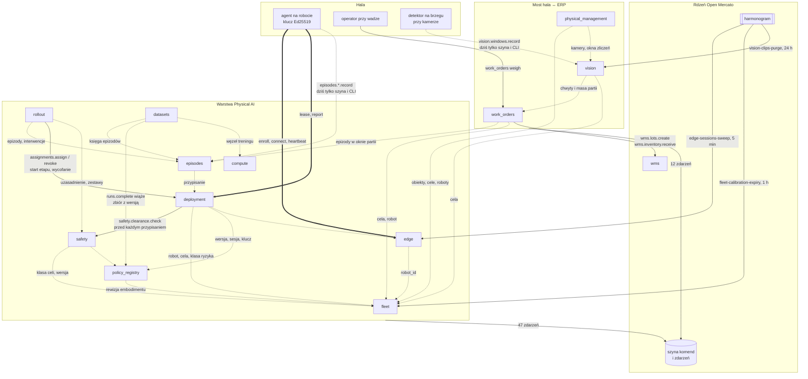
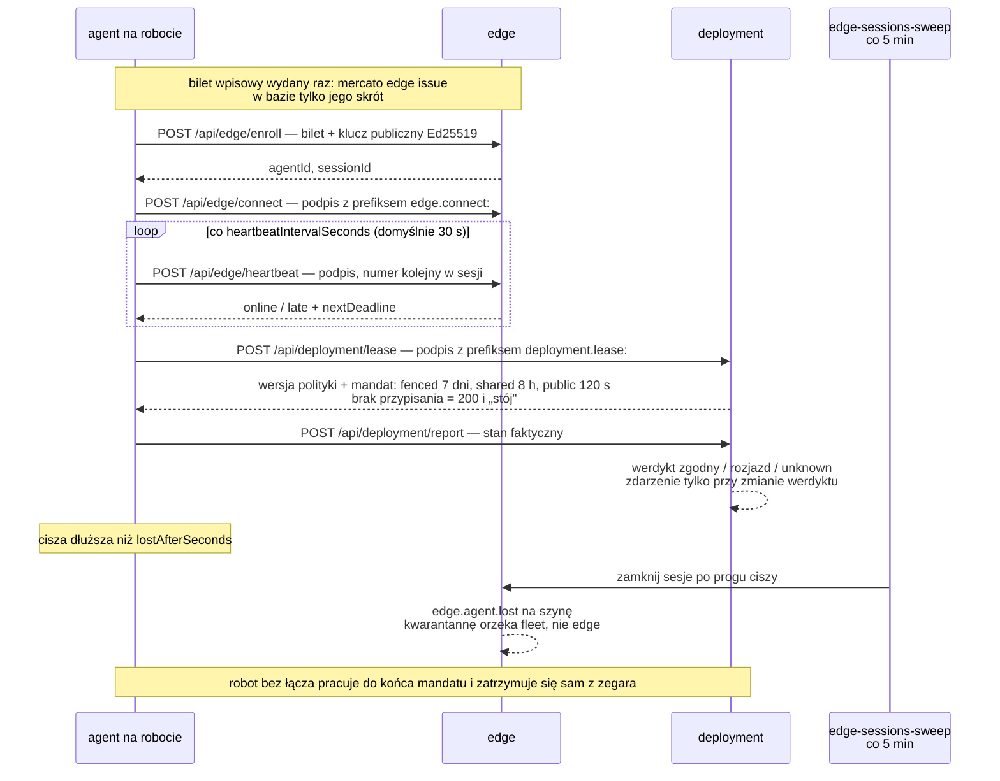
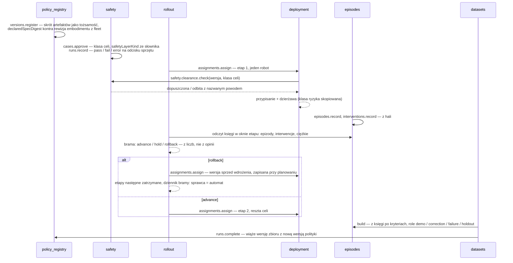
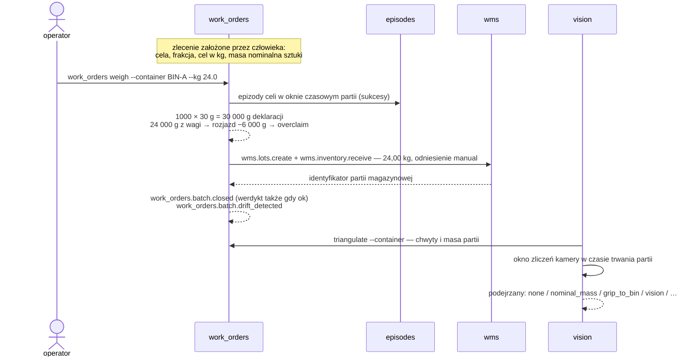

# Sortownia i Physical AI

Moduły Open Mercato dla sortowni odpadów: most do starego systemu ewidencji
(webERP przez XML-RPC i pliki), ewidencja magazynowo-sprzedażowa w platformie
oraz warstwa operacyjna dla robotów sortujących uczonych metodami RL.

Repozytorium nie zawiera Open Mercato. Moduły z `mercato/modules` kopiuje się
do klonu platformy skryptem `mercato/install.sh`; źródłem prawdy zostaje to
repozytorium.

## Trzy światy

| Świat | Gdzie | Co to jest |
| --- | --- | --- |
| System legacy sortowni | `legacy/`, `client/`, `webui/`, `tests/` | Symulator starego systemu: SQLite w schemacie webERP, serwer XML-RPC z sześcioma metodami istniejącymi w webERP, cykliczny zrzut CSV/XLSX, klient integracyjny. Python 3.11, sama biblioteka standardowa. |
| Ewidencja w Open Mercato | `mercato/modules/sortownia` | Magazyn z partiami i pojemnościami, katalog frakcji, CRM kontrahentów, zamówienia, faktury, wpłaty, karty przekazania odpadu. Wszystko komendami rdzenia platformy. |
| Hala z robotami | `mercato/modules/*`, `physical-ai/` | Trzynaście modułów od rejestru floty, przez tożsamość agenta i dopuszczenie bezpieczeństwa, po zbiory treningowe; most hala ↔ ERP; wizja; digital twin hali. |

Teza warstwy robotycznej (`physical-ai/README.md`): platforma nie steruje
robotem i nie uczy polityki. Wiąże wersję polityki z flotą pod zatwierdzonym
uzasadnieniem bezpieczeństwa i prowadzi zapis tego, co gdzie działało, co
zrobiło i kto interweniował.

## Mapa komunikacji

Trzy rodzaje strzałek, bo to trzy różne mechanizmy:

| Strzałka | Znaczy | Przykład |
| --- | --- | --- |
| `==>` | HTTP z hali, bez sesji użytkownika, podpis Ed25519 | agent → `POST /api/edge/heartbeat` |
| `-->` | komenda przez szynę Open Mercato (audyt, zdarzenia, indeks) | `deployment` → `safety.clearance.check` |
| `-.->` | odczyt encji innego modułu (SQL albo MikroORM), bez zapisu | `rollout` czyta księgę `episodes` |



Kierunek strzałek jest kierunkiem zależności. Moduły warstwy Physical AI nie
dotykają `wms`, `catalog` ani `sales`; jedynym miejscem, w którym praca robota
staje się stanem magazynu, jest `work_orders`. Zdarzenia trafiają na szynę
i nie mają dziś żadnego subskrybenta — pełny obieg „zdarzenie → reakcja" nie
jest jeszcze obserwowalny.

## Mapa repozytorium

```
openmercato_garbagekind/
├── legacy/            schema.sql, generate.py, server.py, spooler.py, xlsx.py
├── client/            weberp_sync.py — XML-RPC + wsad/ → out/*.csv
├── tests/             test_end_to_end.py — 19 testów kanału legacy
├── webui/             simag.html — makieta ekranu starego systemu
├── run_demo.sh        generator → serwer → spooler → klient pełny → przyrostowy
├── mercato/
│   ├── install.sh     kopiuje moduły do klonu Open Mercato i włącza je w modules.ts
│   ├── embodiments/   so101_follower.json — opis sprzętu manipulatora SO-101
│   ├── README.md      moduł sortownia w szczegółach
│   └── modules/       14 modułów (niżej)
└── physical-ai/       README (dowody faz 0–6), ROADMAP, EVENTS, ERP-BRIDGE, VISION,
                       HMI, COMPUTE, PLANT-VIEW, OPERATIONS, EMBODIMENTS, HANDOFF-PHYSICAL
```

Każdy moduł ma ten sam szkielet: `index.ts`, `acl.ts`, `setup.ts`,
`data/entities.ts`, `migrations/`, `commands/`, `events.ts`, `api/`,
`backend/<ekran>/page.tsx`, `cli.ts`, `i18n/`, `__tests__/`. Moduł bez własnego
stanu nie ma pustych plików na pokaz: `hmi` nie ma `events.ts`, `sortownia`
nie ma `commands/`.

## Kanał legacy

Serwer i klient mówią dialektem prawdziwego webERP — te same nazwy metod,
ta sama mechanika sesji (`Login` zwraca kod, dalej ciasteczko `PHPSESSID`),
ta sama ścieżka `/api/api_xml-rpc.php`. Po zmianie jednego URL-a klient
zadziała przeciw prawdziwej instancji.


Dane, których webERP przez XML-RPC nie wystawia (katalog kontrahentów, katalog
frakcji, księga ruchów), idą tak, jak w rzeczywistym wdrożeniu: plikiem
z księgowości. Żadnych wymyślonych metod. Klient w Pythonie czyta te same dwa
źródła i służy demo oraz testom; platformę zasila czytelnik w TypeScript.

## Moduł `sortownia`

| Legacy (webERP) | Open Mercato | Co dochodzi po drodze |
| --- | --- | --- |
| `locations` | wms: magazyn, strefy, lokalizacje | pojemność boksu w kg |
| `stockmaster` | catalog: produkt i wariant | kod odpadu jako SKU, kod procesu odzysku R1–R5, próg wysyłki |
| `debtorsmaster` | customers: firma (`customers.companies.create`) | rola DOS/ODB jako etap cyklu życia (`supplier` / `customer`), NIP i BDO w opisie, klucz idempotencji w polu `source` |
| `stockmoves` PZ / SORT / WZ | `wms.inventory.receive` / `transfer` / `issue` | partia dostawcy przy przyjęciu, para SORT jako jeden transfer, rozkład na partie FIFO, `stkmoveno` jako `referenceId` |
| `salesorders` | sales: zamówienie, faktura, wysyłka | VAT 23 %, numer faktury z generatora platformy, karta przekazania odpadu dla zrealizowanych wydań |
| `debtortrans` | sales: wpłata i rozliczenie faktury | wiek należności; rozjazd kwoty raportowany, nie nadpisywany |
| — | customers: szansa sprzedaży (`customers.deals.create`) | każdy odbiorca ma szansę `win` z wartością równą sumie brutto zamówień; dostawca nie ma żadnej |

Kolejność importu wynika z zależności i nie jest kosmetyczna:

```
topologia → frakcje → kontrahenci → zamówienia (+faktury)
          → karty przekazania → wpłaty → partie → księga ruchów → rezerwacje → CRM
```

Rezerwacje idą po księdze, bo przed ruchami magazyn jest pusty i WMS odmówiłby
każdej. Import jest idempotentny: drugie uruchomienie raportuje same duplikaty
i nie dopisuje ani jednego ruchu.

Krok CRM (`lib/crm.ts`, także osobno: `yarn mercato sortownia sync-crm`)
pilnuje, żeby zakładki „Firmy" i „Szanse sprzedaży" mówiły to samo:
`customer` → szansa `win`, `prospect` → `open`, `supplier` → żadnej; w drugą
stronę firma bez etapu dostaje go ze statusu szansy, a wygrana szansa
awansuje potencjalnego klienta na klienta.

Pulpit `/backend/sortownia` liczy masy z encji WMS, więc magazyn i ekran
zawsze mówią to samo; magazyn liczy w kilogramach, ekran pokazuje tony.
`integration.ts` rejestruje system legacy jako konektor w hubie Data Sync
(kursor po numerze ruchu, przebieg próbny).

Szczegóły, w tym dwa błędy, które wyszły dopiero na żywych danych:
[`mercato/README.md`](mercato/README.md).

## Warstwa Physical AI

Osiem modułów w kolejności zależności. Każde ogniwo działa bez tych poniżej:

```
fleet            co istnieje, gdzie stoi i czy wolno mu pracować
edge             kto się odzywa, czym to udowadnia, kiedy odezwał się ostatnio
policy_registry  co to za polityka i na jakim sprzęcie wolno ją uruchomić
safety           czy wolno ją uruchomić w tej KLASIE celi
deployment       ten robot ma uruchomić tę wersję, na tak długo
episodes         co zrobił i kto przerwał
rollout          iść dalej czy wycofać — z liczb księgi, nie z opinii
datasets         z jakich epizodów powstał zbiór i która polityka się na nim uczyła
```

Jeden wyjątek od jednokierunkowości: `deployment` woła
`safety.clearance.check` przed zapisem przypisania. Dopuszczenie jest warunkiem
wstępnym, nie skutkiem ubocznym — wariant zdarzeniowy zostawiałby okno,
w którym robot pracuje niedopuszczoną polityką.

Faza jest zamknięta, gdy zdanie o zachowaniu systemu zachodzi na żywej
instancji, nie gdy suita jest zielona. Każdy moduł ma komendę `prove`,
a przebiegi są zapisane w `physical-ai/README.md`.

### Agent na robocie: od biletu do ciszy



Powtórka numeru kolejnego, obcy klucz i bilet użyty drugi raz odbijają się
jako 401 na tym samym poziomie. Heartbeat nie generuje zdarzenia; faktem jest
dopiero jego brak.

### Od wgrania wag do nowej wersji



Wiązanie zbiór ↔ polityka powstaje wyłącznie przy domknięciu przebiegu
treningowego; przebieg udany bez wskazanej polityki jest odrzucany.

| Moduł | Za co odpowiada | Tabele | Komendy | Zdarzenia | Testy | Ekran |
| --- | --- | ---: | ---: | ---: | ---: | --- |
| `fleet` | roboty, klasy sprzętowe, obiekty, cele, kalibracje z terminem ważności; właściciel osobno od operatora; geometria hali | 6 | 5 | 8 | 88 | `/backend/fleet`, `/backend/fleet/<id>`, `/backend/plant` |
| `edge` | tożsamość Ed25519 agenta, bilet wpisowy, sesje, uderzenia serca; żywotność liczona przy odczycie z `last_seen_at` | 4 | 7 | 7 | 55 | `/backend/edge` |
| `policy_registry` | wersje polityk identyfikowane skrótem artefaktów, wiązane z rewizją embodimentu, nie z robotem; `release` osobno od `manage` | 4 | 3 | 5 | 45 | `/backend/policies` |
| `safety` | uzasadnienie bezpieczeństwa per klasa celi, zestawy ewaluacyjne, incydenty; odmowa dla polityki zadeklarowanej jako funkcja bezpieczeństwa | 4 | 7 | 8 | 50 | `/backend/safety` |
| `deployment` | przypisanie wersji do robota i dzierżawa: `fenced` 7 dni, `shared` 8 h, `public` 120 s; uzgodnienie stanu z trzecim werdyktem `unknown` | 3 | 4 | 4 | 45 | `/backend/deployment` |
| `episodes` | epizod jako atom pracy, interwencja jako własna tabela; raport epizodów między interwencjami zgodny z księgą | 2 | 3 | 4 | 40 | `/backend/episodes` |
| `rollout` | wdrożenia etapowe z bramą na liczbach z księgi; wycofanie domyślne; nie ma uprawnienia „pomiń bramę" | 4 | 3 | 5 | 37 | `/backend/rollout` |
| `datasets` | wersje zbiorów budowane z księgi po kryteriach, role `demo`/`correction`/`failure`/`holdout`, przebiegi treningowe zamykające pętlę | 4 | 4 | 4 | 44 | `/backend/datasets` |

Liczby policzone z `migrations/`, `commands/`, `events.ts` i `__tests__/`
każdego modułu na gałęzi `main`.

## Most i wsparcie

| Moduł | Za co odpowiada | Tabele | Komendy | Zdarzenia | Testy | Ekran |
| --- | --- | ---: | ---: | ---: | ---: | --- |
| `sortownia` | most legacy → WMS, katalog, CRM, sprzedaż, KPO; pulpit; konektor Data Sync; bez własnych komend | 0 | 0 | 0 | 245 | `/backend/sortownia` |
| `work_orders` | most hala ↔ ERP: zlecenie, partia, masa z wagi kontra deklaracja robota; masy w gramach całkowitych | 3 | 4 | 5 | 28 | `/backend/work_orders` |
| `vision` | kamery z celem ustawowym, detektory z progiem ufności, okna zliczeń, retencja 90 dni, triangulacja trzech świadków | 4 | 6 | 7 | 57 | `/backend/vision` |
| `physical_management` | digital twin hali: warstwa wyłącznie odczytowa nad `fleet` i `vision` | 0 | 0 | 0 | 0 | `/backend/physical-management` |
| `hmi` | żetony, słownik stanów i elementy SVG dla ekranów operatorskich; norma szara, kolor tylko dla odstępstwa | 0 | 0 | 0 | 26 | biblioteka |
| `compute` | rejestr węzłów obliczeniowych i przypisań; przepustowość pamięci obowiązkowa; rola `safety_function` nie istnieje w słowniku | 2 | 2 | 2 | 20 | CLI |

Trzy moduły bez własnych tabel to nie przypadek: `sortownia`
i `physical_management` czytają cudze encje, `hmi` jest biblioteką wzorników.

### Most hala ↔ ERP

Robot mówi: 1000 udanych chwytów. Przy masie nominalnej 30 g to 30,00 kg.
Waga pod pojemnikiem mówi: 24,00 kg. Sześciu kilogramów nie ma, a w telemetrii
robota nie widać po nich śladu.

- Do magazynu idzie masa z wagi, nigdy deklaracja robota
  (`wms.inventory.receive` z 24,00 kg).
- Rozjazd nie wstrzymuje przyjęcia — materiał fizycznie istnieje. Werdykt
  `overclaim` podnosi flagę na maszynę, nie na towar
  (`work_orders.batch.drift_detected`).
- Most jest jednokierunkowy: epizody → masa. Zamówienie sprzedaży nie zleca
  pracy robotowi.

Rachunek w gramach jako liczbach całkowitych; rozjazd zbiorczy sumuje gramy,
nie uśrednia procentów. Szczegóły: [`physical-ai/ERP-BRIDGE.md`](physical-ai/ERP-BRIDGE.md).



Okno czasowe partii wyprowadzane jest z danych (otwarcie i zamknięcie
partii), nie z zegara ani ze stałej — ten sam błąd wrócił w projekcie trzy razy.

### Trzeci świadek

Kamera nad pojemnikiem jest trzecim, niezależnym pomiarem obok deklaracji
robota i wagi. Dwóch świadków wystarcza, żeby stwierdzić rozjazd; trzech —
żeby powiedzieć co.

| wizja | robot | masa | podejrzany |
| ---: | ---: | ---: | --- |
| 1000 | 1000 | 1000 | `none` |
| 1000 | 1000 | 800 | `nominal_mass` — sztuki lżejsze niż nominał, nie wina robota |
| 800 | 1000 | 800 | `grip_to_bin` — materiał ginie między chwytem a pojemnikiem |
| 800 | 1000 | 1000 | `vision` — kamera nie widzi, materiał jest |
| 1300 | 1000 | 1000 | `foreign_material` |
| 1000 | 700 | 1000 | `under_reporting` |
| 600 | 1000 | 1500 | `inconclusive` |

Platforma nie widzi ani jednej klatki: wnioskowanie dzieje się na brzegu,
do ERP trafiają okna zliczeń. Odmowy (odrzucenie zapisu, nie ostrzeżenie):
detektor ze słownikiem emocji lub biometrii (AI Act art. 5), kamera z celem
spoza katalogu art. 22² Kodeksu pracy, retencja ponad 90 dni, próg ufności
równy zeru. Klasa `person` przechodzi wyłącznie jako obecność.
Szczegóły: [`physical-ai/VISION.md`](physical-ai/VISION.md).

### Digital twin hali

Dwa ekrany, zero własnych tabel.

`/backend/physical-management` (moduł `physical_management`) to jeden endpoint
odczytowy nad `fleet_sites`, `fleet_cells`, `fleet_robots`, `vision_cameras`
i `vision_detection_windows`: obiekt, cele z geometrią i klasą ryzyka, źródła
wideo, anonimowe zliczenia osób. Odpowiedź niesie deklarację
`rawVideoStoredInErp: false`, `biometricIdentityStored: false`. Stan kamery
(online, stale, waiting) wynika z wieku ostatniego okna, nie z flagi.

`/backend/plant` (moduł `fleet` z elementami `hmi`) to rzut hali w skali.
Cztery źródła składane w przeglądarce — `fleet` (geometria, stan), `edge`
(łączność), `work_orders` (kilogramy), `vision` (podejrzani) — trzy z nich
opcjonalne: brak modułu odejmuje warstwę, nie wywraca rysunku. Cela bez
kompletu współrzędnych nie jest rysowana, tylko wypisana obok, bo zmyślona
pozycja jest gorsza niż jej brak. Odświeżanie co 15 sekund; to pulpit
ewidencyjny, nie sterowniczy.


Łączenie warstw idzie po identyfikatorze celi, nie po nazwie — dlatego panele
`work_orders` i `vision` zwracają `cellId`.

## Zdarzenia

59 zdarzeń w 11 modułach, żadnego zadeklarowanego bez odpowiadającego `emit`
w kodzie. Trzy reguły częstotliwości:

- Ruch nie jest faktem. Uderzenie serca, wydanie dzierżawy i sprawdzenie
  dopuszczenia nie emitują; faktem jest dopiero brak heartbeatu
  (`edge.agent.lost`).
- Wyzwalanie zboczem. `deployment.state.drift_detected` porównuje werdykt
  z poprzednim raportem tej samej maszyny.
- Odhaczanie w danych. `fleet.calibration.expired` raz na kalibrację,
  znacznik w `expiry_notified_at`. Jedyny wyjątek: `vision.clips.deletion_overdue`
  powtarza się codziennie, bo naruszenie trwa codziennie.

Zdarzenia nie obchodzą granic modułów: `edge` ogłasza ciszę, kwarantannę
orzeka `fleet`. Katalog z ładunkami: `GET /api/events?module=<nazwa>`
i [`physical-ai/EVENTS.md`](physical-ai/EVENTS.md).

## Zadania cykliczne i wejścia agenta

| Moduł | Kolejka | Co ile | Co robi |
| --- | --- | --- | --- |
| `vision` | `vision-clips-purge` | 24 h | oznacza materiał po terminie ustawowym; bajtów nie kasuje, czeka na `vision.clips.confirm_deletion` od tego, kto je trzyma |
| `edge` | `edge-sessions-sweep` | 5 min | zamyka sesje agentów po progu ciszy i ogłasza `agent.lost`; nie kwarantannuje |
| `fleet` | `fleet-calibration-expiry` | 1 h | ogłasza wygaśnięcie kalibracji raz na kalibrację; nie zatrzymuje maszyn |

Moduł doinstalowany do istniejącego wdrożenia nie dostaje harmonogramu
z `seedDefaults` — stąd idempotentne `mercato <moduł> install-schedules`.

Jedyne endpointy bez sesji użytkownika — agent uwierzytelnia się podpisem
Ed25519 kluczem, którego centrala nie ma, z prefiksem wiążącym kontekst
i licznikiem sekwencji per sesja:

```
POST /api/edge/enroll
POST /api/edge/connect
POST /api/edge/heartbeat
POST /api/deployment/lease
POST /api/deployment/report
```

Heartbeat zwraca robotowi własny termin odcięcia; dzierżawa mówi, jak długo
wolno mu pracować bez centrali. Cela ogrodzona — dni, dzielona — godziny,
publiczna — minuty.

## Zasady

Wspólne dla wszystkich faz (`physical-ai/ROADMAP.md`):

1. Zapis wyłącznie szyną komend; uprawnienia przez `acl.ts` i `setup.ts`;
   encje przez MikroORM z jawną migracją; ekran przez `backend/<nazwa>/page.tsx`.
2. Każda faza wypisuje, czego w module nie ma i dlaczego.
3. Dowód zaliczenia to zdanie o zachowaniu systemu, nie lista plików.
4. Każda decyzja z kuszącą alternatywą trafia do tabeli z powodem odrzucenia.
5. Nie wolno rozluźniać asercji, żeby test przeszedł.

Trzy warunki, pod którymi Open Mercato jest właściwym fundamentem:

- `catalog`, `sales`, `wms` nie stają się zależnością modułu robotycznego;
  dotykają ich tylko `work_orders` i `sortownia`.
- Granica control plane / data plane: żadna telemetria, artefakt binarny ani
  strumień teleoperacji nie idzie przez szynę komend ani MikroORM. W tabelach
  są adresy i skróty.
- Wyuczona polityka nigdy nie jest funkcją bezpieczeństwa. Uzasadnienie
  z taką deklaracją nie daje się zatwierdzić; rola `safety_function` nie
  istnieje w słowniku `compute`. Bezpieczeństwo egzekwuje osobna,
  deterministyczna warstwa.

Podstawa regulacyjna: rozporządzenie (UE) 2023/1230 (stosowane od 20 stycznia
2027), AI Act art. 5 i art. 6 ust. 1, ISO 10218-1/-2:2025, ISO/TS 15066:2016,
art. 22² Kodeksu pracy.

## Uruchomienie

Wymagania: Python 3.11+ (sama biblioteka standardowa), klon Open Mercato
(Node.js, Yarn, PostgreSQL; Redis i Meilisearch opcjonalne).

Kanał legacy, sam w sobie, bez Open Mercato:

```bash
./run_demo.sh                              # generator → serwer → spooler → klient pełny → przyrostowy
PAUSE=5 ./run_demo.sh --reserve-step 3     # krótsza pauza
python3 -m unittest discover -s tests -t . -v
```

Krok po kroku:

```bash
python3 legacy/generate.py --db legacy/sortownia.db --wsad legacy/wsad
python3 legacy/server.py  --db legacy/sortownia.db --port 8088 &
python3 legacy/spooler.py --db legacy/sortownia.db --wsad legacy/wsad --interval 5 &
python3 client/weberp_sync.py --wsad legacy/wsad --out out --full
python3 client/weberp_sync.py --out out    # kolejne uruchomienia: tryb przyrostowy
```

Konto testowe: `demo` / `demo`, firma `weberpdemo`.

Moduły w klonie Open Mercato:

```bash
MERCATO_ROOT=/sciezka/do/open-mercato ./mercato/install.sh    # albo: install.sh fleet edge
cd /sciezka/do/open-mercato/apps/mercato
yarn generate && yarn mercato db migrate
yarn mercato auth sync-role-acls
yarn mercato sortownia import              # wymaga działającego legacy/server.py
yarn mercato fleet seed
yarn mercato <moduł> prove                 # dowód fazy: fleet, edge, policy_registry, deployment,
                                           # episodes, rollout, safety, datasets, work_orders, vision
yarn mercato vision install-schedules && yarn mercato edge install-schedules && yarn mercato fleet install-schedules
```

Testy modułów:

```bash
cd apps/mercato
yarn jest src/modules/sortownia            # 245
yarn jest src/modules/fleet                # i tak dalej: 14 modułów, razem 780 testów
```

## Czego projekt nie robi

- Karty przekazania odpadu są wewnętrznym odzwierciedleniem KPO powiązanym
  z wysyłką; nie ma połączenia z rządowym API rejestru BDO.
- Przyjęcie odpadu na plac jest operacją magazynową. Nie ma księgi zakupowej
  ani fakturowania opłat bramowych od dostawców.
- Sprzedaż frakcji nalicza 23 % VAT bez podzielonej płatności i odwrotnego
  obciążenia.
- Platforma nie wysyła poleceń trajektorii do sterowników robotów.
  Zatrzymanie natychmiastowe należy do deterministycznej warstwy
  bezpieczeństwa, która nie przechodzi przez tę platformę.
- Żaden moduł nie widział prawdziwej wagi, prawdziwego robota ani prawdziwej
  kamery. Epizody, masy i zliczenia w dowodach pochodzą z komend `prove`.
- Epizody, interwencje i okna detekcji wchodzą wyłącznie szyną komend i CLI.
  Warstwa HTTP dla telemetrii agenta nie istnieje
  (`physical-ai/HANDOFF-PHYSICAL.md`, G1).
- Kolejność, jednostki i układy odniesienia wektora obserwacji i akcji są
  kontraktem słownym. System sprawdza liczbę wymiarów, nie ich znaczenie.

## Dokumentacja

- [`mercato/README.md`](mercato/README.md) — moduł `sortownia`
- [`physical-ai/README.md`](physical-ai/README.md) — decyzje i dowody faz 0–6
- [`physical-ai/ROADMAP.md`](physical-ai/ROADMAP.md) — mapa faz
- [`physical-ai/ERP-BRIDGE.md`](physical-ai/ERP-BRIDGE.md) — `work_orders`
- [`physical-ai/VISION.md`](physical-ai/VISION.md) — `vision`
- [`physical-ai/PLANT-VIEW.md`](physical-ai/PLANT-VIEW.md), [`physical-ai/HMI.md`](physical-ai/HMI.md) — rzut hali i system wizualny
- [`physical-ai/EVENTS.md`](physical-ai/EVENTS.md) — zdarzenia modułowe
- [`physical-ai/OPERATIONS.md`](physical-ai/OPERATIONS.md) — zadania cykliczne
- [`physical-ai/COMPUTE.md`](physical-ai/COMPUTE.md) — `compute` i DGX Spark
- [`physical-ai/EMBODIMENTS.md`](physical-ai/EMBODIMENTS.md) — format opisu sprzętu
- [`physical-ai/HANDOFF-PHYSICAL.md`](physical-ai/HANDOFF-PHYSICAL.md) — zadania dla zespołu uczącego roboty
