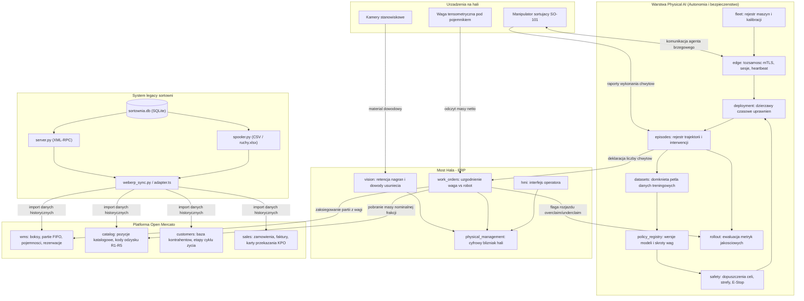
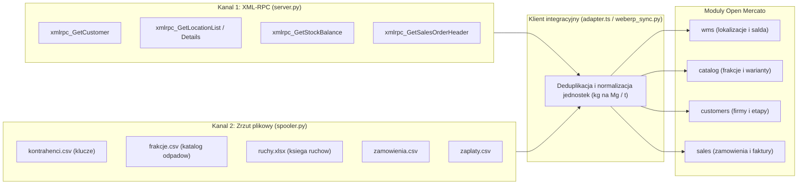
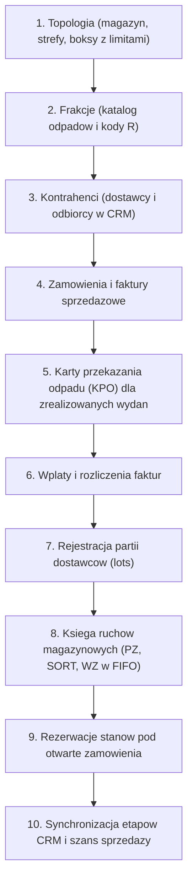
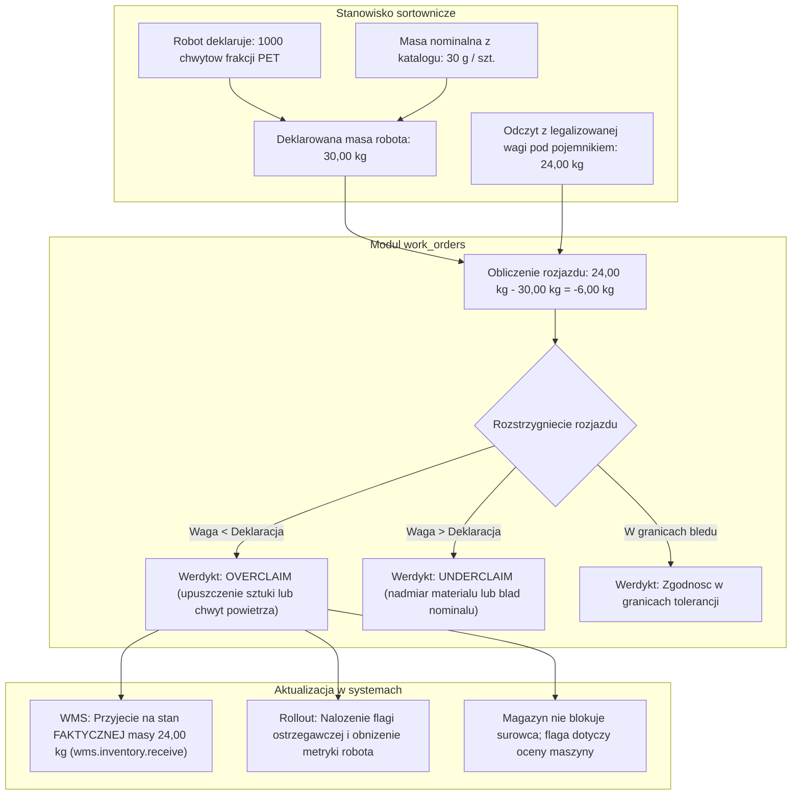
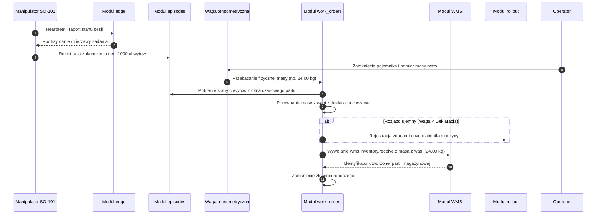

# Sortownia: Integracja ERP i Robotyki Przemysłowej (Physical AI)

System integrujący infrastrukturę sortowni odpadów z platformą Open Mercato.
Projekt łączy trzy domeny:
1. System legacy sortowni (interfejs XML-RPC w dialekcie webERP oraz zrzuty plikowe).
2. Ewidencję gospodarczo-magazynową w Open Mercato (WMS, CRM, sprzedaż, fakturowanie, KPO).
3. Warstwę wykonawczą na hali (roboty sortujące SO-101, wagi tensometryczne, kamery wizyjne i pętla uczenia maszynowego).

---

## 1. Główny schemat interakcji między komponentami (Poziom ogólny)

Architektura systemu łączy warstwę urządzeń przemysłowych, moduły sterowania robotami, most uzgadniający zapasy oraz ewidencję ERP:



---

## 2. Podsystem Legacy ERP i zasilanie bazy (Poziom średni)

### 2.1. Dwa kanały danych

Dane historyczne oraz bieżące zasilenie z instalacji legacy pobierane są dwoma torami:



### 2.2. Mapowanie struktur danych

| Tabela Legacy (webERP) | Encje Open Mercato | Zasada mapowania |
| --- | --- | --- |
| `locations` (`PRZYJ`, `BOKS1-4`, `MAGRDF`) | `wms_warehouses`, `wms_warehouse_zones`, `wms_warehouse_locations` | Odwzorowanie kodów na strefy (`staging`/`bin`) oraz nadanie limitów `capacity_weight` w kg. |
| `stockmaster` | `catalog_products`, `catalog_product_variants` | Kod odpadu staje się SKU wariantu; dodanie kodów procesów odzysku (R1, R3, R4, R5). |
| `locstock` | `wms_inventory_balances` | Rejestracja stanów magazynowych w rozbiciu na `on_hand`, `reserved` i `allocated`. |
| `stockmoves` (`PZ`) | `wms.inventory.receive` | Przyjęcie na plac z założeniem rekordu partii (`wms_inventory_lots`) dostawcy. |
| `stockmoves` (`SORT`) | `wms.inventory.move` | Złożenie pary wierszy legacy (rozchód z placu i przychód do boksu) w jeden atomowy ruch `transfer`. |
| `stockmoves` (`WZ`) | `wms.inventory.adjust` | Rozchód z boksu powiązany z zamówieniem sprzedaży odbiorcy. |
| `stkmoveno` | `idempotency_key` WMS | Deterministyczny `referenceId` gwarantujący brak duplikatów przy powtórnym imporcie. |
| `debtorsmaster` | `customer_entities`, `customer_companies` | Rozdział na dostawców (`DOS`) i odbiorców (`ODB`) wraz z NIP i numerem rejestrowym BDO. |
| `salesorders` | `sales_orders`, `sales_order_lines` | Pozycje zamówień z ceną jednostkową i wyliczeniem podatku VAT. |
| — | `sales_invoices` | Wystawienie faktury powiązanej z zamówieniem (`INV-...`). |
| `debtortrans` | `sales_payments` | Rozliczenia powiązane z fakturami, analiza wieku należności. |
| — | `sales_shipments` | Karta przekazania odpadu (KPO) generowana dla faktycznie zrealizowanych wydań. |

### 2.3. Sekwencja importu danych

Procedura importu zachowuje kolejność wymuszoną zależnościami relacyjnymi:



---

## 3. Podsystem Robotyki i Zarządzania Flotą (Physical AI)

Cykl życia modeli sterujących pracą robotów sortujących realizowany jest przez 8 modułów:

```mermaid
stateDiagram-v2
    direction LR
    [*] --> Fleet: Rejestracja maszyny i weryfikacja kalibracji
    Fleet --> Edge: Uwierzytelnienie kryptograficzne agenta
    Edge --> PolicyRegistry: Sprawdzenie wersji modelu (skrot SHA-256)
    PolicyRegistry --> Safety: Ocena dopuszczenia celi i procedur E-Stop
    Safety --> Deployment: Wydanie ograniczonej czasowo dzierzawy
    Deployment --> Episodes: Wykonanie trajektorii i zliczanie chwytow
    Episodes --> Rollout: Weryfikacja metryk skutecznosci
    Rollout --> Datasets: Agregacja danych (korekty operatorskie)
    Datasets --> PolicyRegistry: Trening nowej wersji modelu
```



* **`fleet`**: Przechowuje rejestr fizycznych ramion, parametry chwytaków, konfigurację stopni swobody (DOF) oraz daty ważności świadectw kalibracji.
* **`edge`**: Obsługuje sesje agentów brzegowych, weryfikuje tokeny tożsamości maszyn oraz monitoruje sygnały heartbeat, zamykając sesje nieaktywne.
* **`policy_registry`**: Utrzymuje wersje wag modeli sieci neuronowych identyfikowane skrótem kryptograficznym SHA-256, weryfikując zgodność wymiarów wejść/wyjść z manipulatorem.
* **`safety`**: Blokuje wydanie dzierżawy w przypadku braku certyfikacji strefy, niesprawnych barier optoelektronicznych lub wygasłej kalibracji.
* **`deployment`**: Przyznaje maszynie czasową dzierżawę zadania sortowniczego; utrata łączności unieważnia uprawnienia do kontynuowania ruchu.
* **`episodes`**: Rejestruje szczegółowe dane każdego cyklu roboczego wraz z pełnym zapisem ewentualnych przejęć sterowania przez człowieka.
* **`rollout`**: Realizuje stopniowe wdrożenia (canary deployment); bramki automatycznie cofają wdrożenie przy wzroście poślizgów materiału.
* **`datasets`**: Tworzy zbiory danych uczących z wyodrębnieniem epizodów zawierających interwencje jako danych korekcyjnych.

---

## 4. Most Hala - ERP: Uzgadnianie masy (Poziom szczegółowy)

Punkt styku telemetrii robota z księgą magazynową WMS opiera się na rozdziale deklaracji maszyny od fizycznego pomiaru:



Obliczenia wewnętrzne mostu wykonywane są w **gramach w liczbach całkowitych**, co eliminuje błędy zmiennoprzecinkowe przy sumowaniu tysięcy operacji.

---

## 5. Przebieg operacyjny obsługi partii (Diagram sekwencji)

Poniższy diagram przedstawia przepływ danych od momentu zważenia surowca na hali do aktualizacji ewidencji magazynowej:



---

## 6. Struktura modułów w repozytorium

```
openmercato_garbagekind/
├── legacy/                    Symulator systemu legacy sortowni (Python, stdlib)
│   ├── schema.sql             Struktura bazy danych (tabele debtorsmaster, stockmoves, etc.)
│   ├── generate.py            Generator bazy danych z powtarzalnym ziarnem
│   ├── server.py              Serwer XML-RPC obslugujacy 6 autentycznych metod webERP
│   ├── spooler.py             Cykliczny eksport katalogow i ksiegi (ruchy.xlsx)
│   ├── xlsx.py                Czytnik arkuszy Excel bez zaleznosci zewnetrznych
│   ├── sortownia.db           Baza SQLite z danymi testowymi
│   └── wsad/                  Katalog wymiany plikowej
│
├── client/                    Klient integracyjny (Python)
│   └── weberp_sync.py         Pobiera dane z XML-RPC i plikow, generuje pliki CSV
│
├── out/                       Wyniki synchronizacji gotowe do importu
│   ├── kontrahenci.csv, frakcje.csv, lokalizacje.csv, stany.csv, ruchy.csv, ...
│   └── .last_sync             Znacznik czasowy synchronizacji przyrostowej
│
├── mercato/                   Zestaw modulow platformy Open Mercato (TypeScript)
│   ├── install.sh             Skrypt instalacji modulow w glownym katalogu aplikacji
│   └── modules/
│       ├── sortownia/         Most legacy: obsluga WMS, CRM, Sales, KPO, pulpit dyrektora
│       ├── physical_management/ Cyfrowy blizniak hali i monitorowanie komorek roboczych
│       ├── fleet/             Rejestr robotow, definicje embodimentow (SO-101), kalibracja
│       ├── edge/              Agent brzegowy, tozsamosc kryptograficzna, sesje, heartbeat
│       ├── policy_registry/   Modele AI, skroty wag SHA-256, zgodnosc przestrzeni DOF
│       ├── safety/            Dopuszczenia celi, strefy bezpieczenstwa, obsluga E-Stop
│       ├── deployment/        Dzierzawy czasowe uprawnien wykonawczych
│       ├── episodes/          Ksiega trajektorii i rejestr interwencji operatora
│       ├── rollout/           Automatyczne bramki wdrazania progresywnego (canary)
│       ├── datasets/          Pętla danych uczacych i probek korekcyjnych
│       ├── work_orders/       Most hala - ERP: uzgadnianie wagi z deklaracja chwytow
│       ├── vision/            Wizja maszynowa, triangulacja, dowod retencji i kasowania nagran
│       ├── hmi/               Paleta przemyslowa i komponenty interfejsu operatora
│       └── compute/           Zarzadzanie wezlami obliczeniowymi na hali
│
├── physical-ai/               Specyfikacje i dokumentacja techniczna warstwy hali
│   ├── ROADMAP.md, README.md, ERP-BRIDGE.md, EMBODIMENTS.md, ...
│
├── webui/                     Pogladowa makieta interfejsu starego systemu
│   └── simag.html             Statyczny interfejs legacy SIMAG 3.11
│
├── tests/                     Testy integracyjne kanalu legacy (Python)
│   └── test_end_to_end.py     19 testow poprawnosci protokolu i spojnosci danych
│
└── run_demo.sh                Skrypt wykonujacy pelny przebieg demonstracyjny
```

---

## 7. Instrukcja uruchomienia i weryfikacji

Wymagania systemowe: **Python 3.11+** (wyłącznie biblioteka standardowa) oraz środowisko **Open Mercato** (Node.js, Yarn, PostgreSQL).

### 7.1. Uruchomienie demonstratora kanału legacy

Wykonanie pełnego łańcucha generator -> serwer -> spooler -> klient pełny -> klient przyrostowy:

```bash
./run_demo.sh
```

Wariant z krótszym czasem oczekiwania:

```bash
PAUSE=5 ./run_demo.sh --reserve-step 3
```

### 7.2. Uruchomienie krok po kroku

1. Inicjalizacja bazy SQLite i zrzutów początkowych:
   ```bash
   python3 legacy/generate.py --db legacy/sortownia.db --wsad legacy/wsad
   ```
2. Start serwera XML-RPC i spoolera plikowego:
   ```bash
   python3 legacy/server.py --db legacy/sortownia.db --port 8088 &
   python3 legacy/spooler.py --db legacy/sortownia.db --wsad legacy/wsad --interval 5 &
   ```
   Konto testowe: użytkownik `demo`, hasło `demo`, firma `weberpdemo`.
3. Pobranie danych przez klienta synchronizującego:
   ```bash
   python3 client/weberp_sync.py --wsad legacy/wsad --out out --full
   python3 client/weberp_sync.py --out out   # kolejne uruchomienia: tryb przyrostowy
   ```
4. Instalacja modułów i wykonanie importu w Open Mercato:
   ```bash
   MERCATO_ROOT=/sciezka/do/open-mercato ./mercato/install.sh
   cd /sciezka/do/open-mercato/apps/mercato
   yarn generate
   yarn mercato sortownia import
   ```

### 7.3. Weryfikacja testami automatycznymi

* Testy modułu `sortownia`:
  ```bash
  cd apps/mercato
  yarn test --testPathPatterns "modules/sortownia"
  ```
  Zestaw 197 testów weryfikuje parser XML-RPC, parowanie wierszy SORT, dekompozycję FIFO na partie, kalkulację podatków oraz obsługę pulpitu.
* Testy modułów Physical AI:
  329 testów weryfikujących łańcuch od rejestracji robotów po generowanie zbiorów danych uczących.
* Testy integracyjne kanału legacy:
  ```bash
  python3 -m unittest discover -s tests -t . -v
  ```
  19 testów kontroluje brak ujemnych stanów, ważność ciasteczek sesyjnych, sumy kontrolne NIP oraz zgodność metod z webERP.

---

## 8. Zakres i ograniczenia systemu

* **Karty przekazania odpadu a urzędowe BDO:** Dokumenty generowane w module `sortownia` stanowią wewnętrzne odzwierciedlenie KPO powiązane z wysyłką magazynową. Moduł nie łączy się z rządowym API rejestru BDO.
* **Granice obsługi zakupów:** Przyjęcie odpadu na plac (`PZ`) stanowi operację magazynową rejestrującą partię surowca. System nie prowadzi księgi zakupowej ani fakturowania opłat bramowych od dostawców.
* **Uproszczenie podatkowe:** Sprzedaż frakcji nalicza standardową stawkę 23% VAT bez automatycznego stosowania mechanizmów podzielonej płatności lub odwrotnego obciążenia.
* **Architektura mostu hali:** Połączenie hali z ERP działa jednokierunkowo pod kątem sterowania ruchem: platforma ewidencjonuje wyniki ważenia i zamyka partie, lecz nie wysyła poleceń trajektorii bezpośrednio do kontrolerów robotów.
